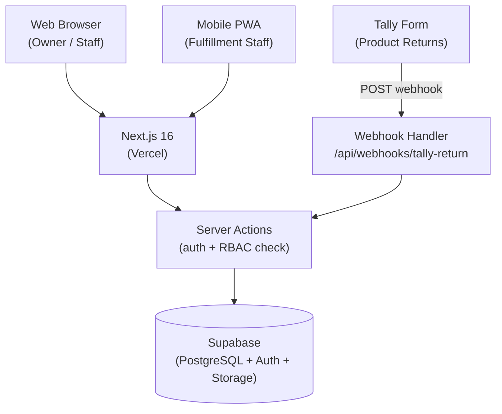

## What It Is

ARKA Backoffice is a full-stack internal web application for managing a Bangkok clothing store's operations. It handles inventory, purchase orders, product returns, cost analysis, employee access control, and a complete audit trail.

The system is accessed by the store owner and staff via web browser. Fulfillment employees use a PWA on mobile to scan QR codes and record stock movements on the warehouse floor.

## Architecture



## Technology Decisions

**Next.js 16 + Server Actions**
All data mutations run through Next.js Server Actions. The RBAC check happens server-side before any Supabase call, so even if a client request is crafted manually, it hits the permission layer first.

**Supabase**
Three Supabase features are used together:
- **PostgreSQL** — primary data store; RLS policies enforce WORM on `stock_transactions` and `audit_log`
- **Auth** — Google OAuth with an email whitelist; only pre-approved addresses can log in
- **Storage** — product images and label PDFs

**Tailwind v4 + shadcn/ui**
Component library provides accessible, unstyled primitives. All visual styling follows the ARKA Backoffice design tokens.

**PWA**
The stock-in and stock-out pages are part of the same Next.js app. The site manifest makes it installable on mobile. No separate app binary — fulfillment staff install from the browser.

**Vercel**
Standard Next.js deployment. Environment variables for Supabase URL and keys are set in the Vercel dashboard.

## Route Structure

```
/                           Dashboard (metrics, recent activity)
/products                   Product list (list/card toggle)
/products/[id]              Product detail + variant management
/stock                      Stock list
/stock/in                   Record stock-in (QR scan, mobile)
/stock/sale                 Record stock-out (QR scan, mobile)
/stock/[variantId]          Transaction history for one variant
/orders                     Purchase orders
/orders/[id]                PO detail + shipment batches
/orders/[id]/receive        Record received shipment
/returns                    Product return requests
/cashflow                   Cash flow transactions
/cost-analysis              Landed COGS + margin analysis
/audit-log                  Immutable action history
/settings/roles             Role and permission matrix
/settings/users             User management
/profile                    Current user profile + session info
```

## Data Model (Summary)

| Table | Purpose |
|-------|---------|
| `products` | Product styles |
| `product_variants` | SKU-level variants (color × size) |
| `stock_transactions` | WORM ledger of all stock movements |
| `purchase_orders` | Supplier POs |
| `shipment_batches` | Received shipments against POs |
| `po_payments` | Payment records for POs |
| `landed_cogs` | Computed landed cost per variant |
| `returns` | Customer return/exchange records |
| `cashflow_transactions` | Business-level money movements |
| `employee_advances` | Staff advance payments |
| `roles` | Role definitions |
| `user_roles` | User-to-role assignments |
| `audit_log` | WORM record of all system actions |
