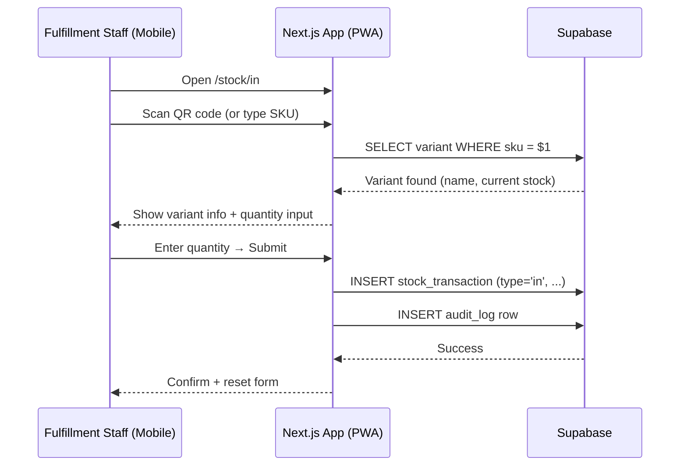
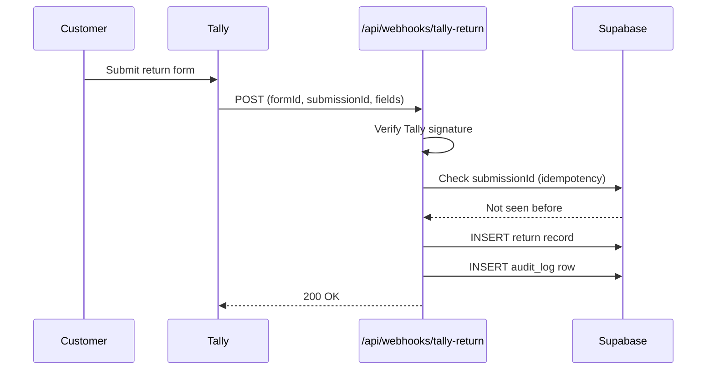

## Stock QR Scan Flow

Every product variant has a QR-code label. The QR code encodes the SKU string directly (e.g., `JN02-DF-M`). No URL, no redirect — just the raw SKU text.

### Stock-In (`/stock/in`)

### Stock-Out (`/stock/sale`)

Identical flow with `type = 'sale'`. The app shows current stock before confirming so staff can catch over-sells.

### Why QR Over Barcode

SKU format `JN02-DF-M` contains three segments separated by `-`. A QR code holds this as a text string without length constraints. Staff can also read and type it without the scanner, which matters when labels are worn or reprinted with a different orientation.

## Tally Webhook for Product Returns

When a customer submits a Tally return form, Tally sends a `POST` request to `/api/webhooks/tally-return`.

The webhook handler:
1. Verifies the Tally HMAC signature
2. Checks `tally_submission_id` to prevent duplicate processing (Tally may retry on non-2xx)
3. Maps form field IDs to the return schema (customer name, contact, order ref, items)
4. Inserts the return record with `status = 'pending'`

Staff see the new return on `/returns` and can print a label or update the status.

## Label Printing

Two label types are generated as PDFs via API routes:

### Stock Label (`/api/labels/stock/[variantId]`)

Generates a printable QR-code label for a product variant. Output includes:
- QR code encoding the SKU
- Human-readable SKU text below the code
- Product name and variant details

### Return Label (`/api/labels/return/[returnId]`)

Generates a return shipping label. Output includes:
- Return reference number
- Customer name and address (from Tally submission)
- Store return address

Both routes return `Content-Type: application/pdf` and stream the response directly — no PDF is saved to Supabase Storage.

## Live Session Tracking

The `/settings/users` page shows:
- Which users are currently online (active Supabase Auth session)
- Last login timestamp for each user

This is useful for the Owner to confirm that only expected staff are active, especially outside business hours.

## Dashboard

The dashboard aggregates key metrics on load:

| Widget | Data source |
|--------|-------------|
| Total SKUs with low stock | `stock_transactions` SUM per variant, threshold configurable |
| Recent stock movements | Last 10 `stock_transactions` across all variants |
| Open purchase orders | `purchase_orders` WHERE `status = 'pending'` |
| Pending returns | `returns` WHERE `status = 'pending'` |
| Recent audit activity | Last 10 `audit_log` rows |

All widgets are server-rendered on page load. No polling or websocket — a refresh is needed to see new activity.
