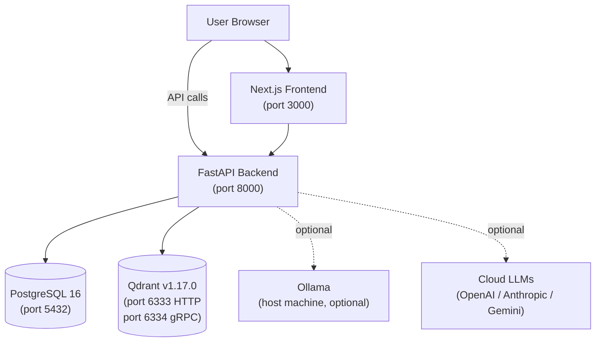
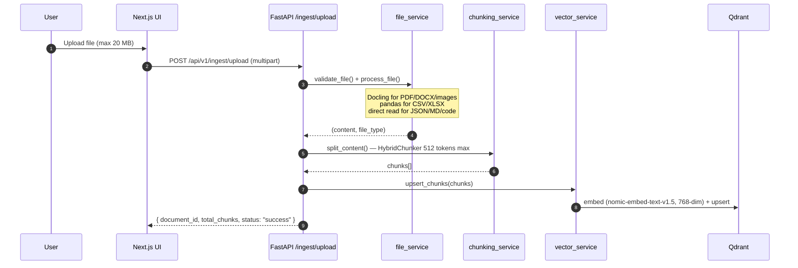
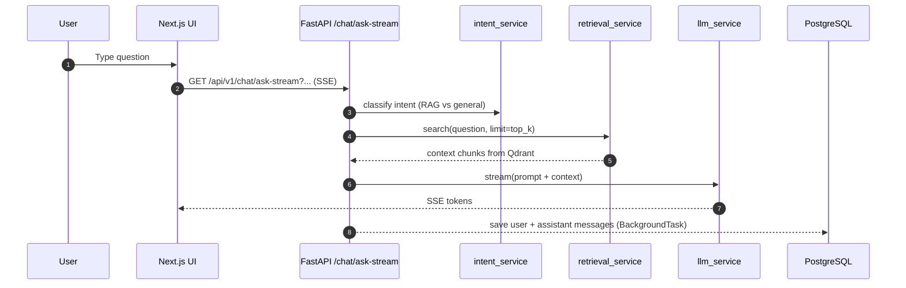

## Architecture Pattern

**Self-Hosted RAG with Direct Service Access**

FastAPI handles all API requests. Next.js calls the backend directly on port 8000 — no reverse proxy. All data stays local: Qdrant stores vectors, PostgreSQL stores chat history.



<Callout type="note">
DocRAG exposes services on individual ports directly. There is no nginx — the frontend calls the backend at `http://localhost:8000`.
</Callout>

---

## Services

| Service | Image | Port | Purpose |
|---------|-------|------|---------|
| frontend | custom | 3000 | Next.js App Router — chat UI, settings, sidebar |
| backend | custom | 8000 | FastAPI REST API + SSE streaming |
| qdrant | `qdrant/qdrant:v1.17.0` | 6333 / 6334 | Vector store for document embeddings |
| postgres | `postgres:16-alpine` | 5432 | Chat session + message persistence |

---

## Data Flow: Document Ingestion



---

## Data Flow: Chat (Streaming)



---

## LLM Setup

<Callout type="tip">
Run Ollama natively on your machine for full privacy. Pull a model with `ollama pull llama3.2`, set `LLM__OLLAMA_BASE_URL=http://host.docker.internal:11434` in `.env`, then run `docker compose up`.
</Callout>

<Callout type="info">
Configure API keys in the **Settings page** — no `.env` edits needed. Keys are stored in the database and returned masked.
</Callout>

<Callout type="warning">
Changing `EMBED_MODEL` after indexing documents requires clearing the vector store (Settings → Storage → Clear Vector Store). The default model `nomic-ai/nomic-embed-text-v1.5` produces 768-dim vectors — incompatible with the previous default `all-MiniLM-L6-v2` (384-dim).
</Callout>

---

## Configuration: Two-Tier

| Tier | Location | What lives here |
|------|----------|----------------|
| Infrastructure | `.env` | DB password, Qdrant host, embed model, Ollama URL |
| User config | DB (`appsetting` table) | API keys (masked), active LLM provider + model, RAG params |

---

## Monorepo Layout

```
DocRAG/
├── frontend/
│   ├── Dockerfile
│   └── src/
│       ├── app/                  # Next.js App Router pages
│       │   ├── page.tsx          # Main chat page
│       │   ├── chat/[session_id]/page.tsx
│       │   └── settings/page.tsx
│       ├── components/           # shadcn/ui + custom components
│       ├── hooks/
│       │   ├── use-chat-store.ts # Zustand — sessions, currentSessionId
│       │   └── use-chat-stream.ts# SSE streaming handler
│       └── lib/
│           └── api.ts            # Typed API client (apiRequest, apiStream, apiUpload)
├── backend/
│   ├── Dockerfile
│   └── app/
│       ├── main.py               # FastAPI app, CORS, router mounting
│       ├── api/v1/               # Route handlers (chat, ingest, documents, query, models, settings, data)
│       ├── models/               # SQLModel models (ChatSession, ChatMessage, AppSetting)
│       ├── services/             # Business logic (llm, retrieval, vector, chunking, file)
│       └── core/                 # Config (pydantic-settings), DB engine, exceptions
├── docker-compose.yml
└── .env.example
```

---

## Health Checks & Startup Order

```
qdrant  (healthy) ─┐
                   ├─→ backend ─→ frontend
postgres (healthy) ┘
```

Backend exposes `GET /health` — returns Qdrant connection status, active LLM provider, and app version.

---

## Supported Document Types

| Format | Processing Engine |
|--------|------------------|
| PDF, DOCX, PNG, JPG | Docling `DocumentConverter` |
| CSV, XLSX | pandas |
| JSON, TXT, MD, PUML, source code | Native UTF-8 read |

All documents chunked via `HybridChunker` (512 tokens max). Embedding model: `nomic-ai/nomic-embed-text-v1.5` (768 dimensions).

---

## LLM Provider Support

| Provider | Mode | Notes |
|----------|------|-------|
| Ollama | Local | Default; Ollama must run on host (`host.docker.internal:11434`) |
| OpenAI | Cloud | API key stored in DB via Settings page |
| Anthropic | Cloud | API key stored in DB via Settings page |
| Gemini | Cloud | API key stored in DB via Settings page |
