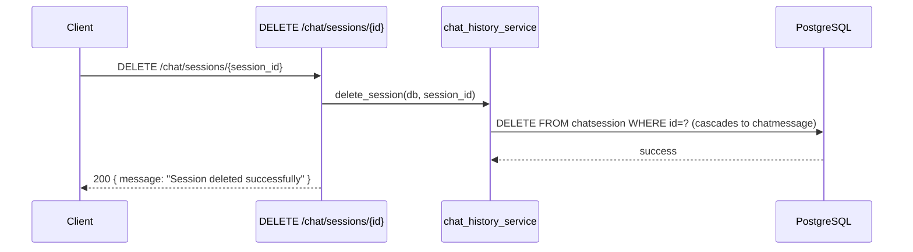

<Callout type="abstract">
Deletes a chat session and all its messages via ORM-level cascade. Called from the sidebar's session delete action.
</Callout>

---

## 🔒 Authentication

None.

---

## 🛠️ Technical Specification

### Request

| Property | Value |
| :--- | :--- |
| **Method** | `DELETE` |
| **Path** | `/api/v1/chat/sessions/{session_id}` |
| **Tags** | `["Chat"]` |

### 📦 Path Parameters

| Param | Type | Required | Description |
| :--- | :--- | :--- | :--- |
| `session_id` | `UUID` | Yes | Session to delete |

### Logic Flow

### 📤 Responses

| Status | Body | Condition |
| :--- | :--- | :--- |
| `200 OK` | `{ message: "Session deleted successfully" }` | Session found and deleted |
| `404 Not Found` | `{ detail: "Session not found" }` | `session_id` not in DB |

### 🗂️ Related Files

| Role | File |
| :--- | :--- |
| Router | `backend/app/api/v1/chat.py :: remove_session()` |
| Delete logic | `backend/app/services/chat_history_service.py :: delete_session()` |
| ORM cascade | `backend/app/models/chat.py :: ChatSession.messages` — `cascade="all, delete-orphan"` |
| UI trigger | `frontend/src/components/nav-session.tsx` → `useChatStore.removeSession()` |

---

## 🗂️ Related

| Role | Link |
| :--- | :--- |
| Create session | `API-POST-v1-chat-sessions` |
| List sessions | `API-GET-v1-chat-sessions` |
| DB cascade details | [DB - chatmessage](/en/docs/docrag/database/db-chatmessage) |
| Zustand store | [Store - ChatStore](/en/docs/docrag/frontend/stores/store-chatstore) |
