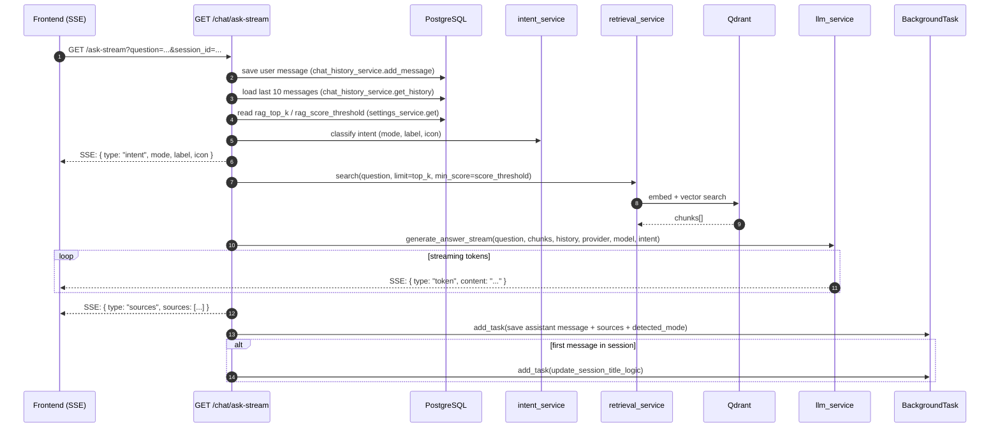

<Callout type="abstract">
The primary chat endpoint. Accepts a question and session context, classifies intent, retrieves relevant document chunks from Qdrant, streams an LLM response via SSE, and persists both the user and assistant messages to PostgreSQL as a `BackgroundTask` after streaming completes.
</Callout>

---

## 🔒 Authentication

None.

---

## 🛠️ Technical Specification

### Request

| Property | Value |
| :--- | :--- |
| **Method** | `GET` |
| **Path** | `/api/v1/chat/ask-stream` |
| **Tags** | `["Chat"]` |
| **Response type** | `text/event-stream` (SSE) |

### 📦 Query Parameters

| Param | Type | Required | Default | Description |
| :--- | :--- | :--- | :--- | :--- |
| `question` | `string` | Yes | — | User's message |
| `session_id` | `UUID` | Yes | — | Active chat session |
| `provider` | `string` | No | `"ollama"` | LLM provider |
| `model` | `string` | No | `"minimax-m2:cloud"` | Model name |
| `top_k` | `int` | No | reads `rag_top_k` from DB (default `5`) | Number of Qdrant chunks to retrieve |
| `score_threshold` | `float` | No | reads `rag_score_threshold` from DB | Minimum similarity score for chunks |

### Logic Flow

### SSE Event Types

| `type` field | Payload | When sent |
| :--- | :--- | :--- |
| `"intent"` | `{ mode, label, icon }` | Before retrieval — signals which mode badge to show |
| `"token"` | `{ content: "..." }` | Each LLM output chunk |
| `"sources"` | `{ sources: SourceItem[] }` | After streaming completes |

### 📤 HTTP Response

| Status | Description |
| :--- | :--- |
| `200 OK` | Stream opened — SSE begins immediately |
| Connection error | Frontend `use-chat-stream.ts` handles abort/error |

### 🗂️ Related Files

| Role | File |
| :--- | :--- |
| Router | `backend/app/api/v1/chat.py :: ask_question_stream()` |
| Intent classification | `backend/app/services/intent_service.py` |
| Vector retrieval | `backend/app/services/retrieval_service.py` |
| LLM streaming | `backend/app/services/llm_service.py :: generate_answer_stream()` |
| Message persistence | `backend/app/services/chat_history_service.py :: add_message()` |
| RAG params | `backend/app/services/settings_service.py` → `appsetting` table |
| Frontend SSE handler | `frontend/src/hooks/use-chat-stream.ts` via `apiStream()` in `lib/api.ts` |

---

## 🗂️ Related

| Role | Link |
| :--- | :--- |
| Non-streaming ask | `API-POST-v1-chat-ask` |
| History load | `API-GET-v1-chat-history-id` |
| RAG settings | [DB - appsetting](/en/docs/docrag/database/db-appsetting) |
| DB message storage | [DB - chatmessage](/en/docs/docrag/database/db-chatmessage) |
