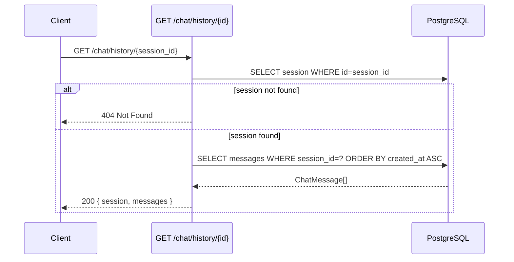

<Callout type="abstract">
Returns the full message history for a session, ordered by `created_at` ascending. Called by `ChatInterface` when `currentSessionId` changes to restore conversation context.
</Callout>

---

## 🔒 Authentication

None.

---

## 🛠️ Technical Specification

### Request

| Property | Value |
| :--- | :--- |
| **Method** | `GET` |
| **Path** | `/api/v1/chat/history/{session_id}` |
| **Tags** | `["Chat"]` |

### 📦 Path Parameters

| Param | Type | Required | Description |
| :--- | :--- | :--- | :--- |
| `session_id` | `UUID` | Yes | Session whose messages to load |

### Logic Flow

### 📤 Responses

| Status | Body | Condition |
| :--- | :--- | :--- |
| `200 OK` | `{ session: ChatSession, messages: ChatMessage[] }` | Session found |
| `404 Not Found` | `{ detail: "Session not found" }` | Invalid `session_id` |

Each `ChatMessage` includes: `id`, `session_id`, `role`, `content`, `provider`, `model`, `sources`, `detected_mode`, `created_at`.

### 🗂️ Related Files

| Role | File |
| :--- | :--- |
| Router | `backend/app/api/v1/chat.py :: get_chat_history()` |
| DB models | `backend/app/models/chat.py :: ChatSession`, `ChatMessage` |
| UI consumer | `frontend/src/components/chat/chat-interface.tsx` |

---

## 🗂️ Related

| Role | Link |
| :--- | :--- |
| Create message (streaming) | `API-GET-v1-chat-ask-stream` |
| DB message table | [DB - chatmessage](/en/docs/docrag/database/db-chatmessage) |
| DB session table | [DB - chatsession](/en/docs/docrag/database/db-chatsession) |
