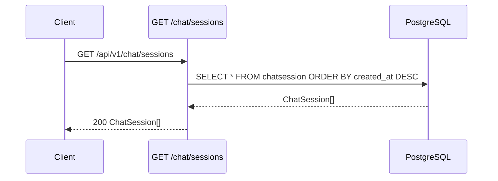

<Callout type="abstract">
Returns all `ChatSession` rows ordered by `created_at` descending (newest first). Called by `AppSidebar` on mount to populate the session list and reconcile the Zustand store cache.
</Callout>

---

## 🔒 Authentication

None.

---

## 🛠️ Technical Specification

### Request

| Property | Value |
| :--- | :--- |
| **Method** | `GET` |
| **Path** | `/api/v1/chat/sessions` |
| **Tags** | `["Chat"]` |

### Logic Flow

### 📤 Responses

| Status | Body | Condition |
| :--- | :--- | :--- |
| `200 OK` | `ChatSession[]` (array, may be empty) | Always succeeds |

Each `ChatSession`: `{ id, title, provider, model_name, created_at, updated_at }`.

### 🗂️ Related Files

| Role | File |
| :--- | :--- |
| Router | `backend/app/api/v1/chat.py` |
| DB model | `backend/app/models/chat.py :: ChatSession` |
| UI consumer | `frontend/src/components/app-sidebar.tsx` → `useChatStore.setSessions()` |

---

## 🗂️ Related

| Role | Link |
| :--- | :--- |
| Create session | `API-POST-v1-chat-sessions` |
| DB table | [DB - chatsession](/en/docs/docrag/database/db-chatsession) |
| Zustand store | [Store - ChatStore](/en/docs/docrag/frontend/stores/store-chatstore) |
