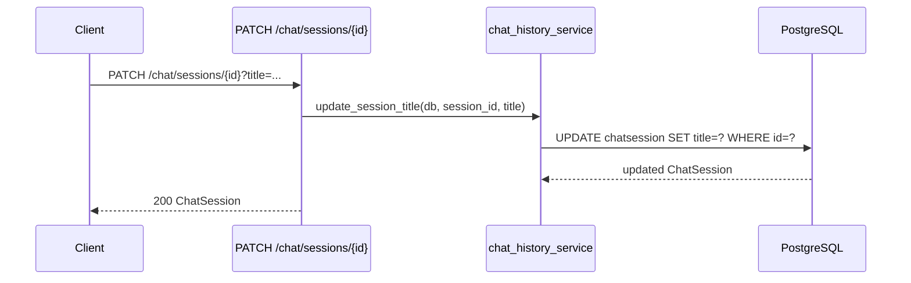

<Callout type="abstract">
Renames a chat session. Called both by the user (inline edit in sidebar) and automatically by the `update_session_title_logic` background task that generates a title from the first message using the LLM.
</Callout>

---

## 🔒 Authentication

None.

---

## 🛠️ Technical Specification

### Request

| Property | Value |
| :--- | :--- |
| **Method** | `PATCH` |
| **Path** | `/api/v1/chat/sessions/{session_id}` |
| **Tags** | `["Chat"]` |

### 📦 Query Parameters

| Param | Type | Required | Description |
| :--- | :--- | :--- | :--- |
| `session_id` | `UUID` | Yes | Path param — target session |
| `title` | `string` | Yes | Query param — new session title |

### Logic Flow

### 📤 Responses

| Status | Body | Condition |
| :--- | :--- | :--- |
| `200 OK` | Updated `ChatSession` object | Session found and renamed |
| `404 Not Found` | `{ detail: "Session not found" }` | `session_id` not in DB |

### 🗂️ Related Files

| Role | File |
| :--- | :--- |
| Router | `backend/app/api/v1/chat.py :: rename_session()` |
| Title update logic | `backend/app/services/chat_history_service.py :: update_session_title()` |
| Auto-title trigger | `backend/app/api/v1/chat.py :: update_session_title_logic()` (BackgroundTask) |
| UI trigger | `frontend/src/components/nav-session.tsx` → `useChatStore.updateSessionTitle()` |

---

## 🗂️ Related

| Role | Link |
| :--- | :--- |
| Create session | `API-POST-v1-chat-sessions` |
| Delete session | `API-DELETE-v1-chat-sessions-id` |
| DB table | [DB - chatsession](/en/docs/docrag/database/db-chatsession) |
