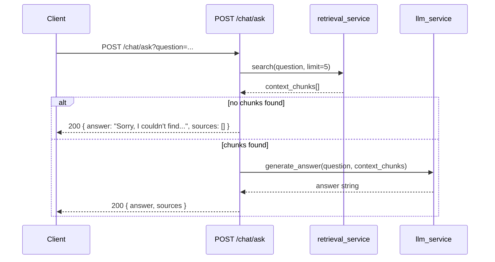

<Callout type="abstract">
Non-streaming single-turn Q&A. Retrieves context chunks, generates a complete answer, and returns it in one JSON response. Does not persist the exchange to the database. Suitable for programmatic usage or simple integrations that don't require streaming.
</Callout>

---

## 🔒 Authentication

None.

---

## 🛠️ Technical Specification

### Request

| Property | Value |
| :--- | :--- |
| **Method** | `POST` |
| **Path** | `/api/v1/chat/ask` |
| **Tags** | `["Chat"]` |

### 📦 Query Parameters

| Param | Type | Required | Description |
| :--- | :--- | :--- | :--- |
| `question` | `string` | Yes | The question to answer |

### Logic Flow

### 📤 Responses

| Status | Body | Condition |
| :--- | :--- | :--- |
| `200 OK` | `{ answer: string, sources: chunk[] }` | Always — even when no context found |

### 🗂️ Related Files

| Role | File |
| :--- | :--- |
| Router | `backend/app/api/v1/chat.py :: ask_question()` |
| Retrieval | `backend/app/services/retrieval_service.py` |
| LLM | `backend/app/services/llm_service.py` |

---

## 🗂️ Related

| Role | Link |
| :--- | :--- |
| Streaming ask (preferred) | `API-GET-v1-chat-ask-stream` |
| Semantic search only | `API-GET-v1-query-search` |
