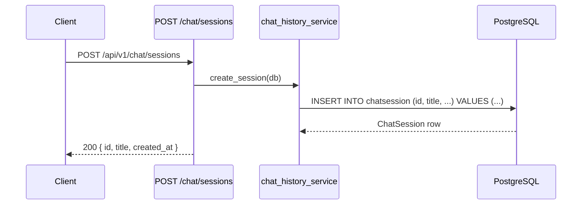

<Callout type="abstract">
Creates a new `ChatSession` row in PostgreSQL with default title and provider, then returns the new session's `id`, `title`, and `created_at`. Called by the sidebar's "New Chat" button — the returned `id` is immediately set as `currentSessionId` in the Zustand store.
</Callout>

---

## 🔒 Authentication

None.

---

## 🛠️ Technical Specification

### Request

| Property | Value |
| :--- | :--- |
| **Method** | `POST` |
| **Path** | `/api/v1/chat/sessions` |
| **Tags** | `["Chat"]` |
| **Body** | None — no request body required |

### Logic Flow

### 📤 Responses

| Status | Body | Condition |
| :--- | :--- | :--- |
| `200 OK` | `{ id: UUID, title: "New Conversation", created_at: ISO8601 }` | Session created |

### 🗂️ Related Files

| Role | File |
| :--- | :--- |
| Router | `backend/app/api/v1/chat.py` |
| Session creation | `backend/app/services/chat_history_service.py :: create_session()` |
| DB model | `backend/app/models/chat.py :: ChatSession` |
| UI trigger | `frontend/src/components/app-sidebar.tsx` → `useChatStore.addSession()` |

---

## 🗂️ Related

| Role | Link |
| :--- | :--- |
| List sessions | `API-GET-v1-chat-sessions` |
| Rename session | `API-PATCH-v1-chat-sessions-id` |
| Delete session | `API-DELETE-v1-chat-sessions-id` |
| DB table | [DB - chatsession](/en/docs/docrag/database/db-chatsession) |
| Zustand store | [Store - ChatStore](/en/docs/docrag/frontend/stores/store-chatstore) |
