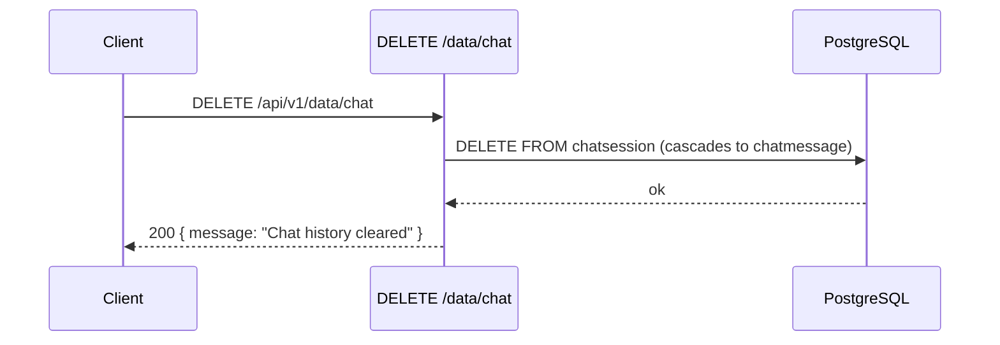

<Callout type="abstract">
Deletes all ChatSession rows from PostgreSQL. Because ChatMessage.session_id has ondelete CASCADE, all messages are also deleted in the same operation. This is irreversible. Exposed via the Storage Settings panel's "Clear Chat History" button.
</Callout>

---

## Authentication

None.

---

## Technical Specification

### Request

| Property | Value |
| :--- | :--- |
| **Method** | DELETE |
| **Path** | /api/v1/data/chat |
| **Tags** | Data |

### Logic Flow

### Responses

| Status | Body | Condition |
| :--- | :--- | :--- |
| 200 OK | { message: "Chat history cleared" } | All sessions and messages deleted |

### Related Files

| Role | File |
| :--- | :--- |
| Router | backend/app/api/v1/data.py :: clear_chat_history() |
| DB cascade | backend/app/models/chat.py :: ChatMessage.session_id FK ondelete CASCADE |
| UI trigger | frontend/src/components/settings/storage-settings.tsx |

---

## Technical Defense

**Q: Why use db.exec(delete(ChatSession)) instead of deleting messages first?**
Deleting sessions triggers the DB-level FK cascade that removes all messages automatically in one round-trip. Manually deleting messages first would be an unnecessary extra query — backend/app/api/v1/data.py.

---

## Change Impact Analysis

| If you change... | These are affected |
| :--- | :--- |
| DB cascade removed from chatmessage.session_id | Messages become orphaned; this endpoint only clears sessions, leaving messages behind |

---

## Related

| Role | Link |
| :--- | :--- |
| Clear vector store | API-DELETE-v1-data-vector |
| DB session table | DB - chatsession |
| DB message table | DB - chatmessage |
