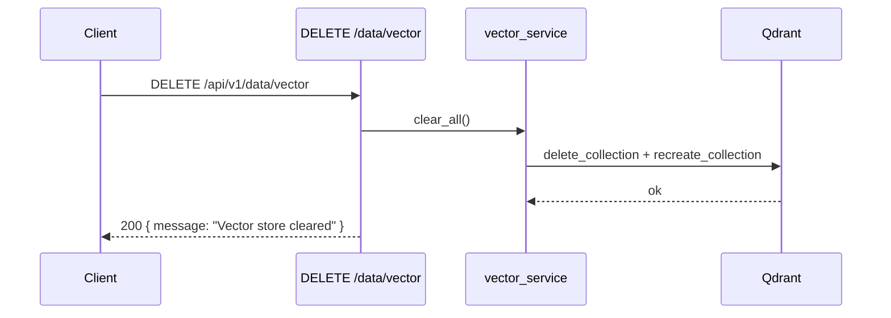

<Callout type="abstract">
Clears all points from the Qdrant collection by dropping and recreating it empty. This is a destructive, irreversible operation — all indexed documents are permanently deleted. Exposed via the Storage Settings panel's "Clear Vector Store" button.
</Callout>

---

## 🔒 Authentication

None.

---

## 🛠️ Technical Specification

### Request

| Property | Value |
| :--- | :--- |
| **Method** | `DELETE` |
| **Path** | `/api/v1/data/vector` |
| **Tags** | `["Data"]` |

### Logic Flow

### 📤 Responses

| Status | Body | Condition |
| :--- | :--- | :--- |
| `200 OK` | `{ message: "Vector store cleared" }` | Collection dropped and recreated |

### 🗂️ Related Files

| Role | File |
| :--- | :--- |
| Router | `backend/app/api/v1/data.py :: clear_vector_store()` |
| Qdrant clear | `backend/app/services/vector_service.py :: clear_all()` |
| UI trigger | `frontend/src/components/settings/storage-settings.tsx` |

---

## 🗂️ Related

| Role | Link |
| :--- | :--- |
| Vector stats | `API-GET-v1-data-stats` |
| Clear chat history | `API-DELETE-v1-data-chat` |
| DevOps (Qdrant config) | [DevOps - DocRAG](/en/docs/docrag/devops/devops-docrag) |
