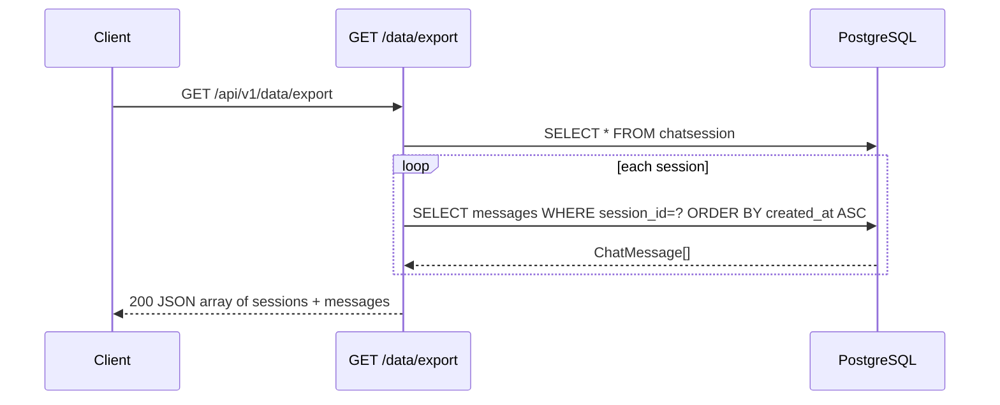

<Callout type="abstract">
Exports all chat sessions and their messages as a JSON array. Output format is compatible with `POST /api/v1/data/import` for backup and restore workflows.
</Callout>

---

## 🔒 Authentication

None.

---

## 🛠️ Technical Specification

### Request

| Property | Value |
| :--- | :--- |
| **Method** | `GET` |
| **Path** | `/api/v1/data/export` |
| **Tags** | `["Data"]` |

### Logic Flow

### 📤 Responses

| Status | Body | Condition |
| :--- | :--- | :--- |
| `200 OK` | `[{ title, provider, model_name, created_at, messages: [{ role, content, provider, model, created_at }] }]` | Always (may be empty array) |

<Callout type="note">
`sources` and `detected_mode` are not included in the export — only `role`, `content`, `provider`, `model`, `created_at` are exported per message.
</Callout>

### 🗂️ Related Files

| Role | File |
| :--- | :--- |
| Router | `backend/app/api/v1/data.py :: export_chat()` |
| DB models | `backend/app/models/chat.py :: ChatSession`, `ChatMessage` |

---

## 🗂️ Related

| Role | Link |
| :--- | :--- |
| Import chat | `API-POST-v1-data-import` |
| DB session table | [DB - chatsession](/en/docs/docrag/database/db-chatsession) |
