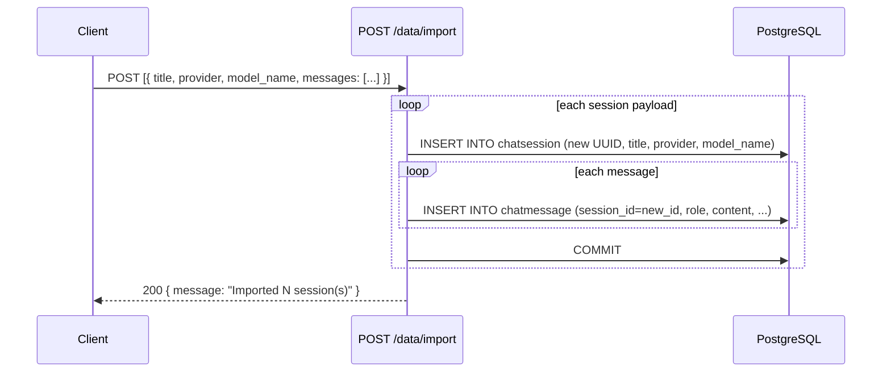

<Callout type="abstract">
Imports one or more chat sessions (with messages) from a JSON payload. Creates new `ChatSession` rows with new UUIDs — does not deduplicate or merge with existing sessions. Designed as the restore counterpart to `GET /api/v1/data/export`.
</Callout>

---

## 🔒 Authentication

None.

---

## 🛠️ Technical Specification

### Request

| Property | Value |
| :--- | :--- |
| **Method** | `POST` |
| **Path** | `/api/v1/data/import` |
| **Tags** | `["Data"]` |
| **Content-Type** | `application/json` |

### 📦 Request Body

```json
[
  {
    "title": "Imported Conversation",
    "provider": "ollama",
    "model_name": "",
    "messages": [
      { "role": "user", "content": "Hello", "provider": "ollama", "model": "" },
      { "role": "assistant", "content": "Hi there!", "provider": "ollama", "model": "" }
    ]
  }
]
```

| Field | Type | Required | Default |
| :--- | :--- | :--- | :--- |
| `title` | `string` | No | `"Imported Conversation"` |
| `provider` | `string` | No | `"ollama"` |
| `model_name` | `string` | No | `""` |
| `messages[].role` | `string` | Yes | — |
| `messages[].content` | `string` | Yes | — |
| `messages[].provider` | `string` | No | `"ollama"` |
| `messages[].model` | `string` | No | `""` |

### Logic Flow



### 📤 Responses

| Status | Body | Condition |
| :--- | :--- | :--- |
| `200 OK` | `{ message: "Imported N session(s)" }` | All sessions created |

### 🗂️ Related Files

| Role | File |
| :--- | :--- |
| Router | `backend/app/api/v1/data.py :: import_chat()` |
| Pydantic schemas | `ImportSessionPayload`, `ImportMessagePayload` in `data.py` |
| DB models | `backend/app/models/chat.py :: ChatSession`, `ChatMessage` |

---

## 🗂️ Related

| Role | Link |
| :--- | :--- |
| Export chat | `API-GET-v1-data-export` |
| DB session table | [DB - chatsession](/en/docs/docrag/database/db-chatsession) |
| DB message table | [DB - chatmessage](/en/docs/docrag/database/db-chatmessage) |
