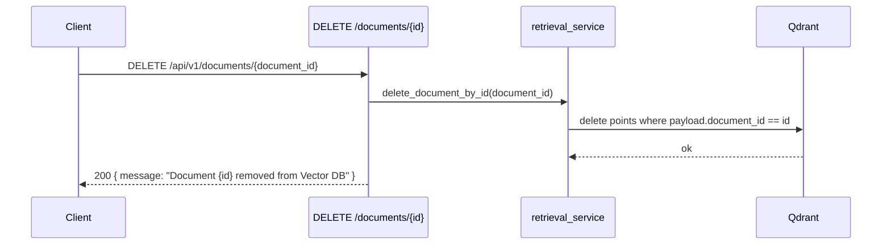

<Callout type="abstract">
Removes all Qdrant vector points belonging to the given `document_id`. This is the only way to delete an indexed document — there is no corresponding row in PostgreSQL to clean up.
</Callout>

---

## 🔒 Authentication

None.

---

## 🛠️ Technical Specification

### Request

| Property | Value |
| :--- | :--- |
| **Method** | `DELETE` |
| **Path** | `/api/v1/documents/{document_id}` |
| **Tags** | `["Documents"]` |

### 📦 Path Parameters

| Param | Type | Required | Description |
| :--- | :--- | :--- | :--- |
| `document_id` | `string` (UUID) | Yes | UUID assigned at ingest time |

### Logic Flow

### 📤 Responses

| Status | Body | Condition |
| :--- | :--- | :--- |
| `200 OK` | `{ message: "Document {document_id} removed from Vector DB" }` | All chunks deleted |
| `500 Internal Server Error` | `{ detail: "..." }` | Qdrant operation failure |

### 🗂️ Related Files

| Role | File |
| :--- | :--- |
| Router | `backend/app/api/v1/documents.py` |
| Qdrant delete filter | `backend/app/services/retrieval_service.py :: delete_document_by_id()` |
| UI trigger | `frontend/src/components/chat/knowledge-base.tsx` |

---

## 🗂️ Related

| Role | Link |
| :--- | :--- |
| List documents | `API-GET-v1-documents` |
| Ingest | `API-POST-v1-ingest-upload` |
