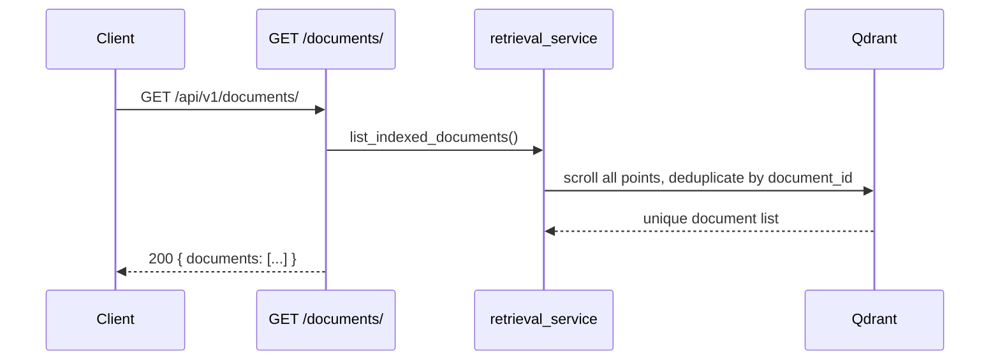

<Callout type="abstract">
Lists all documents currently indexed in the Qdrant vector store. Each entry represents a unique uploaded file, identified by its `document_id`. Used by the Knowledge Base panel to populate the document list with delete actions.
</Callout>

---

## 🔒 Authentication

None.

---

## 🛠️ Technical Specification

### Request

| Property | Value |
| :--- | :--- |
| **Method** | `GET` |
| **Path** | `/api/v1/documents/` |
| **Tags** | `["Documents"]` |

### Logic Flow

### 📤 Responses

| Status | Body | Condition |
| :--- | :--- | :--- |
| `200 OK` | `{ documents: [{ document_id, file_name, ... }] }` | Always succeeds |

### 🗂️ Related Files

| Role | File |
| :--- | :--- |
| Router | `backend/app/api/v1/documents.py` |
| Qdrant list logic | `backend/app/services/retrieval_service.py :: list_indexed_documents()` |
| UI consumer | `frontend/src/components/chat/knowledge-base.tsx` |

---

## 🗂️ Related

| Role | Link |
| :--- | :--- |
| Delete document | `API-DELETE-v1-documents-id` |
| Ingest | `API-POST-v1-ingest-upload` |
