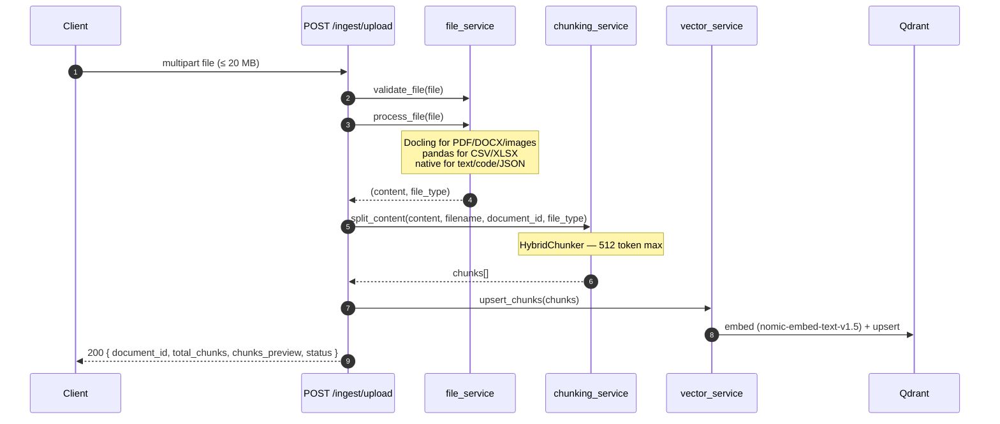

<Callout type="abstract">
Accepts a multipart file upload, converts it to text via the appropriate engine, chunks it (max 512 tokens), embeds each chunk, and upserts into Qdrant. Returns the assigned `document_id` and a preview of the first 3 chunks.
</Callout>

---

## 🔒 Authentication

None — no auth layer in DocRAG.

---

## 🛠️ Technical Specification

### Request

| Property | Value |
| :--- | :--- |
| **Method** | `POST` |
| **Path** | `/api/v1/ingest/upload` |
| **Content-Type** | `multipart/form-data` |
| **Tags** | `["Ingestion"]` |
| **File size limit** | 20 MB (enforced in `file_service.validate_file()`) |

### 📦 Request Body

| Field | Type | Required | Notes |
| :--- | :--- | :--- | :--- |
| `file` | `UploadFile` | Yes | Any supported format |

**Supported formats:**

| Format | Processing Engine | Resulting `file_type` |
| :--- | :--- | :--- |
| PDF, DOCX, PNG, JPG | Docling `DocumentConverter` | `"docling"` |
| CSV | pandas | `"text"` (after `process_csv()`) |
| XLSX | pandas | `"text"` (after `process_xlsx()`) |
| JSON | native | `"text"` (after `process_json()`) |
| TXT, MD, PUML, source code | native UTF-8 | `"text"` or `"code"` |

### Logic Flow

### 📤 Responses

| Status | Body | Condition |
| :--- | :--- | :--- |
| `200 OK` | `{ document_id, file_name, file_type, total_chunks, chunks_preview[0..2], status: "success", message }` | File processed and indexed |
| `400 Bad Request` | `{ detail: "..." }` | File exceeds 20 MB or unsupported type |
| `500 Internal Server Error` | `{ detail: "..." }` | Qdrant upsert failure or Docling processing error |

### 🗂️ Related Files

| Role | File |
| :--- | :--- |
| Router | `backend/app/api/v1/ingest.py` |
| File processing + validation | `backend/app/services/file_service.py` |
| Chunking | `backend/app/services/chunking_service.py` |
| Embedding + Qdrant upsert | `backend/app/services/vector_service.py` |
| UI trigger | `frontend/src/components/chat/knowledge-base.tsx` via `apiUploadWithProgress()` |

---

## 🗂️ Related

| Role | Link |
| :--- | :--- |
| List indexed documents | `API-GET-v1-documents` |
| Delete document | `API-DELETE-v1-documents-id` |
| Semantic search | `API-GET-v1-query-search` |
| DevOps (embed model config) | [DevOps - DocRAG](/en/docs/docrag/devops/devops-docrag) |
