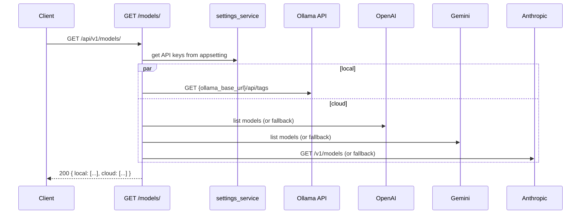

<Callout type="abstract">
Returns available LLM models split into `local` (Ollama) and `cloud` (OpenAI, Anthropic, Gemini) groups. If the API key for a cloud provider is not set or the live fetch fails, returns a hardcoded fallback model list so the UI never shows an empty selector.
</Callout>

---

## 🔒 Authentication

None.

---

## 🛠️ Technical Specification

### Request

| Property | Value |
| :--- | :--- |
| **Method** | `GET` |
| **Path** | `/api/v1/models/` |
| **Tags** | `["Models"]` |

### Logic Flow

### 📤 Responses

| Status | Body | Condition |
| :--- | :--- | :--- |
| `200 OK` | `{ local: ModelItem[], cloud: ModelItem[] }` | Always — uses fallbacks on provider errors |

`ModelItem`: `{ name: string, provider: string }`

**Fallback model lists** (used when no API key or remote call fails):

| Provider | Fallback models |
| :--- | :--- |
| OpenAI | `gpt-4o`, `gpt-4o-mini`, `gpt-3.5-turbo` |
| Gemini | `gemini-2.5-pro-preview-05-06`, `gemini-2.5-flash-preview-04-17`, `gemini-2.0-flash`, + 4 more |
| Anthropic | `claude-3-5-sonnet-20241022`, `claude-3-5-haiku-20241022`, `claude-3-haiku-20240307` |

### 🗂️ Related Files

| Role | File |
| :--- | :--- |
| Router + fetch logic | `backend/app/api/v1/models.py` |
| API key read | `backend/app/services/settings_service.py` → `appsetting` table |
| UI consumer | `frontend/src/components/chat/model-selector.tsx` |
| TypeScript type | `frontend/src/types/chat.ts :: ModelsResponse` |

---

## 🗂️ Related

| Role | Link |
| :--- | :--- |
| Settings (API keys) | `API-GET-v1-settings` |
| DB settings table | [DB - appsetting](/en/docs/docrag/database/db-appsetting) |
| Streaming chat (uses model) | `API-GET-v1-chat-ask-stream` |
