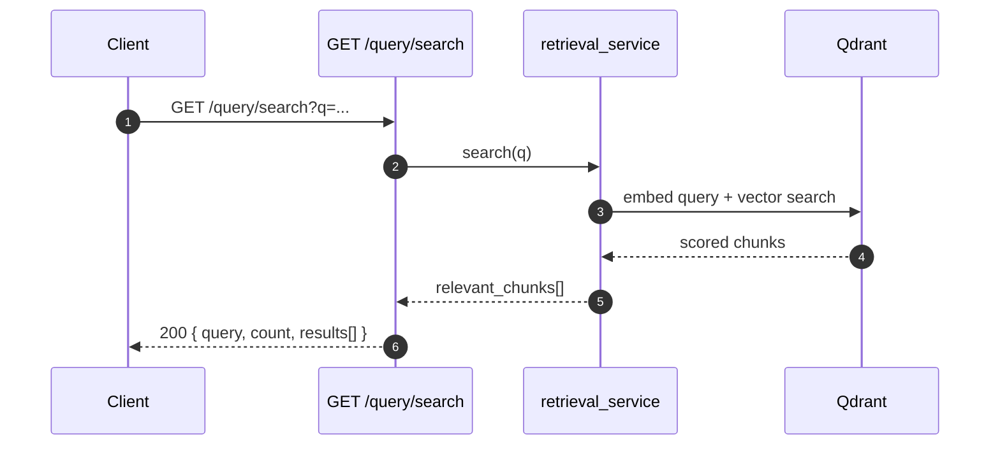

<Callout type="abstract">
Direct semantic search against the Qdrant vector store. Returns the top matching document chunks for a given query string. Used for debugging retrieval quality independently of the chat pipeline.
</Callout>

---

## 🔒 Authentication

None.

---

## 🛠️ Technical Specification

### Request

| Property | Value |
| :--- | :--- |
| **Method** | `GET` |
| **Path** | `/api/v1/query/search` |
| **Tags** | `["Retrieval"]` |

### 📦 Query Parameters

| Param | Type | Required | Description |
| :--- | :--- | :--- | :--- |
| `q` | `string` | Yes | Natural-language search query |

Returns `400` if `q` is empty string.

### Logic Flow

### 📤 Responses

| Status | Body | Condition |
| :--- | :--- | :--- |
| `200 OK` | `{ query: str, count: int, results: chunk[] }` | Search completed (may return 0 results) |
| `400 Bad Request` | `{ detail: "Query string is required" }` | `q` is empty string |

Each result chunk contains: `file_name`, `score`, `snippet`, `page_number`, `section_title`, `element_type`, `language` (from `SourceItem` in `frontend/src/types/chat.ts`).

### 🗂️ Related Files

| Role | File |
| :--- | :--- |
| Router | `backend/app/api/v1/query.py` |
| Qdrant vector search | `backend/app/services/retrieval_service.py` |

---

## 🗂️ Related

| Role | Link |
| :--- | :--- |
| Ingest documents | `API-POST-v1-ingest-upload` |
| Streaming chat (uses retrieval internally) | `API-GET-v1-chat-ask-stream` |
