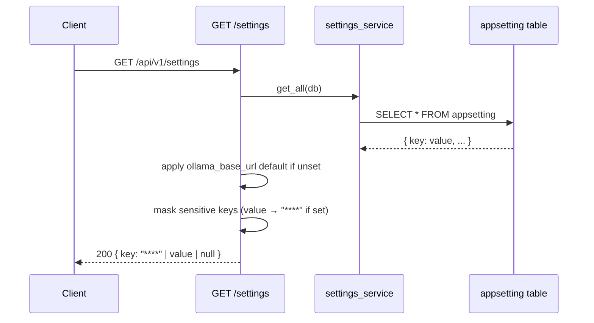

<Callout type="abstract">
Returns all settings from the `appsetting` table as a flat `dict[str, str | null]`. Sensitive keys (API keys) are masked as `"****"` if set. Used by the Settings page to populate all input fields on load.
</Callout>

---

## 🔒 Authentication

None.

---

## 🛠️ Technical Specification

### Request

| Property | Value |
| :--- | :--- |
| **Method** | `GET` |
| **Path** | `/api/v1/settings` |
| **Tags** | `["Settings"]` |

### Logic Flow

### 📤 Responses

| Status | Body | Condition |
| :--- | :--- | :--- |
| `200 OK` | `dict[str, str \| null]` — all settings, sensitive keys masked | Always succeeds |

**Sensitive keys** (masked as `"****"` when set): `openai_api_key`, `anthropic_api_key`, `gemini_api_key`, `openrouter_api_key`, `moonshot_api_key`, `minimax_api_key`, `zai_api_key`.

### 🗂️ Related Files

| Role | File |
| :--- | :--- |
| Router | `backend/app/api/v1/settings.py :: get_settings()` |
| `_SENSITIVE_KEYS` set | `backend/app/api/v1/settings.py` |
| Service | `backend/app/services/settings_service.py :: get_all()` |
| DB table | `backend/app/models/settings.py :: AppSetting` |
| UI consumer | `frontend/src/components/settings/ai-providers-settings.tsx` |

---

## 🗂️ Related

| Role | Link |
| :--- | :--- |
| Update settings | `API-PUT-v1-settings` |
| Test connection | `API-POST-v1-settings-test-connection` |
| DB table | [DB - appsetting](/en/docs/docrag/database/db-appsetting) |
| Settings page | [Page - Settings](/en/docs/docrag/frontend/pages/page-settings) |
