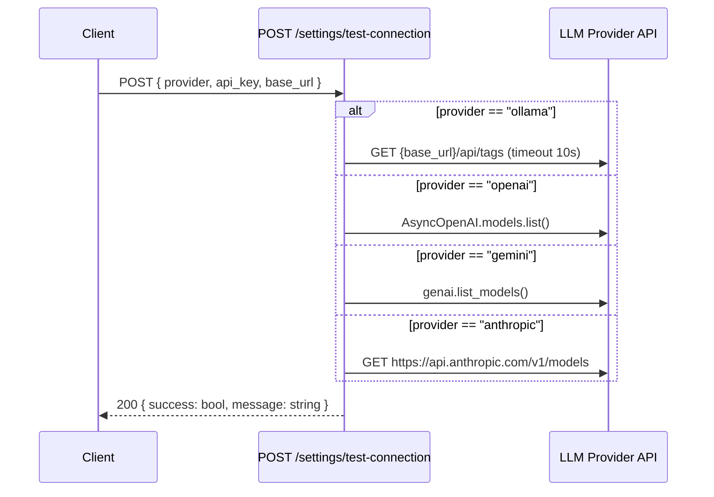

<Callout type="abstract">
Tests connectivity to a given LLM provider using the supplied credentials. Returns success/failure and a human-readable message (e.g. "Connected. 14 model(s) available."). Used by the Settings page "Test Connection" button before saving API keys.
</Callout>

---

## 🔒 Authentication

None.

---

## 🛠️ Technical Specification

### Request

| Property | Value |
| :--- | :--- |
| **Method** | `POST` |
| **Path** | `/api/v1/settings/test-connection` |
| **Tags** | `["Settings"]` |
| **Content-Type** | `application/json` |

### 📦 Request Body

```json
{
  "provider": "ollama",
  "api_key": "sk-...",
  "base_url": "http://host.docker.internal:11434"
}
```

| Field | Type | Required | Description |
| :--- | :--- | :--- | :--- |
| `provider` | `string` | Yes | `"ollama"`, `"openai"`, `"gemini"`, or `"anthropic"` |
| `api_key` | `string \| null` | No | Cloud provider API key (not needed for Ollama) |
| `base_url` | `string \| null` | No | Ollama base URL override |

### Logic Flow



### 📤 Responses

| Status | Body | Condition |
| :--- | :--- | :--- |
| `200 OK` | `{ success: true, message: "Connected. N model(s) available." }` | Provider reachable |
| `200 OK` | `{ success: false, message: "HTTP 401" }` | Provider returned error |
| `500 Internal Server Error` | Unhandled exception | Network timeout or unexpected error |

### 🗂️ Related Files

| Role | File |
| :--- | :--- |
| Router | `backend/app/api/v1/settings.py :: test_connection()` |
| UI trigger | `frontend/src/components/settings/ai-providers-settings.tsx` |

---

## 🗂️ Related

| Role | Link |
| :--- | :--- |
| Read settings | `API-GET-v1-settings` |
| Update settings | `API-PUT-v1-settings` |
| Settings page | [Page - Settings](/en/docs/docrag/frontend/pages/page-settings) |
