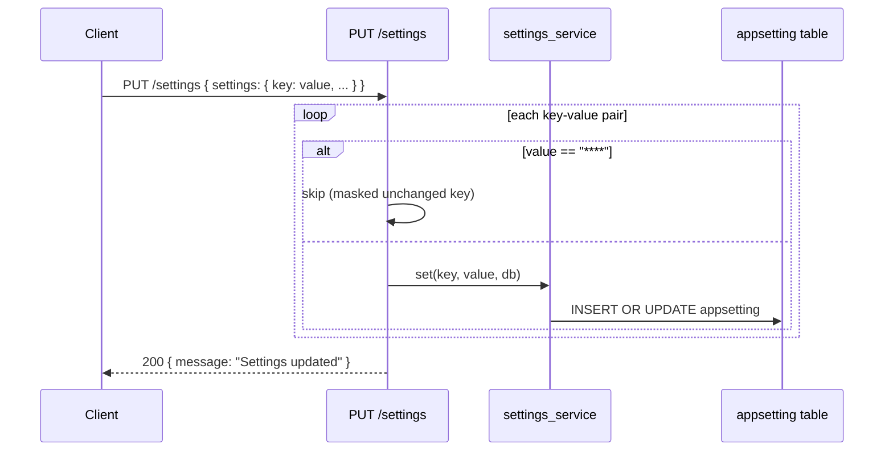

<Callout type="abstract">
Upserts one or more settings keys in the `appsetting` table. Skips any value equal to `"****"` — the frontend sends back the mask for unchanged sensitive fields, and the backend drops those on the floor to prevent overwriting real keys with the placeholder.
</Callout>

---

## 🔒 Authentication

None.

---

## 🛠️ Technical Specification

### Request

| Property | Value |
| :--- | :--- |
| **Method** | `PUT` |
| **Path** | `/api/v1/settings` |
| **Tags** | `["Settings"]` |
| **Content-Type** | `application/json` |

### 📦 Request Body

```json
{
  "settings": {
    "openai_api_key": "sk-...",
    "rag_top_k": "5",
    "ollama_base_url": "http://host.docker.internal:11434"
  }
}
```

All values are strings (numbers stored as string in `appsetting.value`). Send `null` to clear a key.

### Logic Flow



### 📤 Responses

| Status | Body | Condition |
| :--- | :--- | :--- |
| `200 OK` | `{ message: "Settings updated" }` | All non-masked keys upserted |

### 🗂️ Related Files

| Role | File |
| :--- | :--- |
| Router | `backend/app/api/v1/settings.py :: update_settings()` |
| Upsert logic | `backend/app/services/settings_service.py :: set()` |
| DB table | `backend/app/models/settings.py :: AppSetting` |
| UI trigger | `frontend/src/components/settings/ai-providers-settings.tsx` |

---

## 🗂️ Related

| Role | Link |
| :--- | :--- |
| Read settings | `API-GET-v1-settings` |
| Test connection | `API-POST-v1-settings-test-connection` |
| DB table | [DB - appsetting](/en/docs/docrag/database/db-appsetting) |
