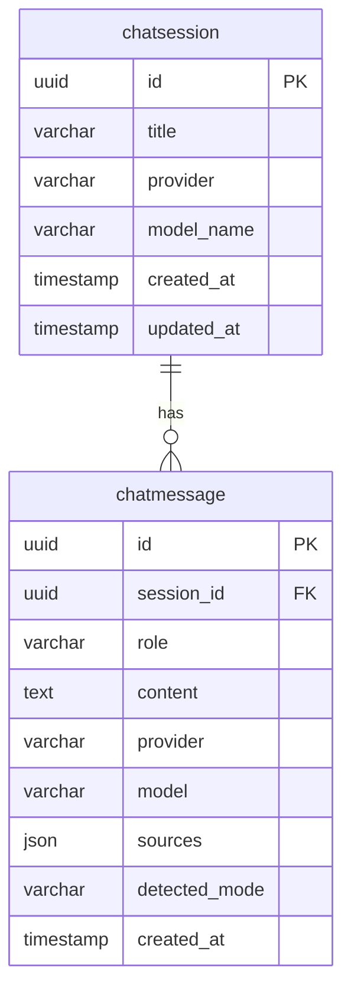

<Callout type="abstract">
Stores individual messages within a chat session. Holds the role (`user` / `assistant` / `system`), the text content, the LLM that generated it, the source document chunks used for RAG context, and the detected intent mode.
</Callout>

---

## Table Info

| Property | Value |
| :--- | :--- |
| **Table Name** | `chatmessage` |
| **SQLAlchemy Model** | `backend/app/models/chat.py :: ChatMessage` |
| **Pydantic Schema** | Inline in `backend/app/api/v1/chat.py` |
| **Migration** | `SQLModel.metadata.create_all(engine)` in `backend/app/core/database.py :: init_db()` |
| **TimescaleDB Hypertable** | No |

---

## Columns

| Column | Type | Nullable | Default | Notes |
| :--- | :--- | :--- | :--- | :--- |
| `id` | `UUID` | No | `uuid.uuid4()` | Primary key |
| `session_id` | `UUID` | No | — | FK → `chatsession.id` with `ondelete="CASCADE"` |
| `role` | `VARCHAR` | No | — | `user`, `assistant`, or `system`; indexed for fast per-role filtering |
| `content` | `TEXT` | No | — | Full message text (no length limit) |
| `provider` | `VARCHAR` | No | `"ollama"` | LLM provider that generated this message |
| `model` | `VARCHAR` | No | `""` | Model name used; empty string for user messages |
| `sources` | `JSON` | Yes | `null` | Retrieved Qdrant chunks used as context (assistant messages only) |
| `detected_mode` | `VARCHAR(50)` | Yes | `null` | Intent classifier output for this turn (assistant messages only) |
| `created_at` | `TIMESTAMP` | No | `datetime.utcnow()` | Message ordering key |

---

## Constraints & Indexes

| Type | Columns | Notes |
| :--- | :--- | :--- |
| PRIMARY KEY | `id` | UUID v4 |
| FOREIGN KEY | `session_id → chatsession.id` | `ondelete="CASCADE"` — deleting session removes all messages |
| INDEX | `role` | `Field(index=True)` — supports filtering messages by role |

---

## Entity Relationships



---

## SQLAlchemy Model (reference snapshot)

```python
class ChatMessage(SQLModel, table=True):
    id: uuid.UUID = Field(default_factory=uuid.uuid4, primary_key=True)
    session_id: uuid.UUID = Field(
        sa_column=Column(pg.UUID(as_uuid=True), ForeignKey("chatsession.id", ondelete="CASCADE"), nullable=False)
    )
    role: str = Field(index=True)  # user, assistant, system
    content: str
    provider: str = Field(default="ollama")
    model: str = Field(default="")
    sources: Optional[List[Any]] = Field(
        default=None, sa_column=Column(JSON, nullable=True)
    )
    detected_mode: Optional[str] = Field(default=None, max_length=50)
    created_at: datetime = Field(default_factory=datetime.utcnow)
    session: ChatSession = Relationship(back_populates="messages")
```

---

## Service Layer

| Operation | File | Notes |
| :--- | :--- | :--- |
| Persist user message | `backend/app/services/chat_history_service.py` | Called before LLM inference |
| Persist assistant message | `backend/app/services/chat_history_service.py` | Called after streaming completes (via `BackgroundTasks`) |
| Fetch session messages | `backend/app/api/v1/chat.py :: GET /chat/history/{id}` | Ordered by `created_at` |
| Streaming ask | `backend/app/api/v1/chat.py :: GET /chat/ask-stream` | SSE; assistant message saved in background task after stream ends |

---

## 🗂️ Related

| Role | Link |
| :--- | :--- |
| Parent table | [DB - chatsession](/en/docs/docrag/database/db-chatsession) |
| Chat API | `backend/app/api/v1/chat.py` |
| Chat history service | `backend/app/services/chat_history_service.py` |
| DevOps | [DevOps - DocRAG](/en/docs/docrag/devops/devops-docrag) |
