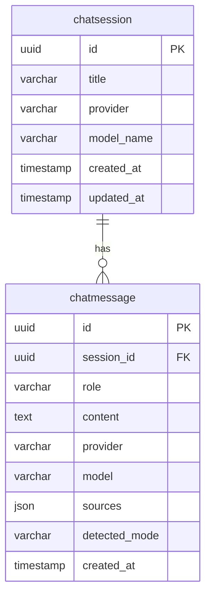

<Callout type="abstract">
Stores one row per conversation session. Groups `ChatMessage` rows and tracks which LLM provider and model were active at session creation time.
</Callout>

---

## Table Info

| Property | Value |
| :--- | :--- |
| **Table Name** | `chatsession` |
| **SQLAlchemy Model** | `backend/app/models/chat.py :: ChatSession` |
| **Pydantic Schema** | Inline in `backend/app/api/v1/chat.py` |
| **Migration** | `SQLModel.metadata.create_all(engine)` in `backend/app/core/database.py :: init_db()` |
| **TimescaleDB Hypertable** | No |

---

## Columns

| Column | Type | Nullable | Default | Notes |
| :--- | :--- | :--- | :--- | :--- |
| `id` | `UUID` | No | `uuid.uuid4()` | Primary key |
| `title` | `VARCHAR` | No | `"New Conversation"` | User-editable via `PATCH /api/v1/chat/sessions/{id}` |
| `provider` | `VARCHAR` | No | `"ollama"` | LLM provider active when session was created |
| `model_name` | `VARCHAR` | No | `"minimax-m2:cloud"` | LLM model active when session was created |
| `created_at` | `TIMESTAMP` | No | `datetime.utcnow()` | Set at Python layer, not DB server default |
| `updated_at` | `TIMESTAMP` | No | `datetime.utcnow()` | Not auto-updated on row change — updated manually by service |

---

## Constraints & Indexes

| Type | Columns | Notes |
| :--- | :--- | :--- |
| PRIMARY KEY | `id` | UUID v4 |
| CASCADE DELETE | via `ChatMessage.session_id` | Deleting a session deletes all its messages — defined on `ChatMessage` FK |

---

## Entity Relationships



---

## SQLAlchemy Model (reference snapshot)

```python
class ChatSession(SQLModel, table=True):
    id: uuid.UUID = Field(default_factory=uuid.uuid4, primary_key=True)
    title: str = Field(default="New Conversation")
    provider: str = Field(default="ollama")
    model_name: str = Field(default="minimax-m2:cloud")
    created_at: datetime = Field(default_factory=datetime.utcnow)
    updated_at: datetime = Field(default_factory=datetime.utcnow)
    messages: List["ChatMessage"] = Relationship(
        back_populates="session",
        sa_relationship_kwargs={"cascade": "all, delete-orphan"},
    )
```

---

## Service Layer

| Operation | File | Notes |
| :--- | :--- | :--- |
| Create session | `backend/app/api/v1/chat.py` | `POST /chat/sessions` |
| List sessions | `backend/app/api/v1/chat.py` | `GET /chat/sessions` |
| Rename session | `backend/app/api/v1/chat.py` | `PATCH /chat/sessions/{id}` — updates `title` |
| Delete session | `backend/app/api/v1/chat.py` | `DELETE /chat/sessions/{id}` — cascades to messages |
| Fetch history | `backend/app/services/chat_history_service.py` | Returns session + ordered messages |

---

## 🗂️ Related

| Role | Link |
| :--- | :--- |
| Child table | [DB - chatmessage](/en/docs/docrag/database/db-chatmessage) |
| Chat API | `backend/app/api/v1/chat.py` |
| DevOps | [DevOps - DocRAG](/en/docs/docrag/devops/devops-docrag) |
