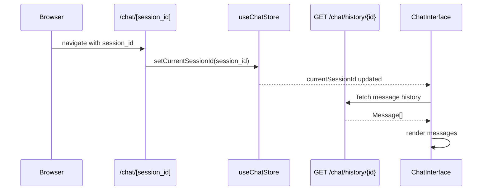

<Callout type="abstract">
Direct-link route to a specific chat session. The `session_id` segment is a UUID that maps to `ChatSession.id`. On load, the page sets `currentSessionId` in the Zustand store so `ChatInterface` loads the correct session history.
</Callout>

---

## Route

| Property | Value |
| :--- | :--- |
| **Path** | `/chat/[session_id]` |
| **File** | `frontend/src/app/chat/[session_id]/page.tsx` |
| **Auth Required** | No |
| **Layout** | `frontend/src/app/layout.tsx` |
| **Dynamic Segment** | `session_id` (UUID string) |

---

## Component Tree

```
RootLayout (layout.tsx)
└── ThemeProvider
    └── SidebarProvider
        ├── AppSidebar
        └── SidebarInset
            └── ChatInterface     ← receives session_id via store
```

---

## Data Layer

### Global State — Zustand

| Store | Fields Read | Actions Called |
| :--- | :--- | :--- |
| `useChatStore` | `currentSessionId`, `selectedProvider`, `selectedModel` | `setCurrentSessionId` (called on mount with URL param) |

### API Calls (within ChatInterface)

| Endpoint | Trigger | Purpose |
| :--- | :--- | :--- |
| `GET /api/v1/chat/history/{session_id}` | On `currentSessionId` change | Load message history |
| `GET /api/v1/chat/ask-stream` | On user message submit | Stream AI response |

---

## Page Lifecycle



---

## Render Conditions

| Condition | Result |
| :--- | :--- |
| Valid `session_id` in URL | History loads; conversation continues |
| `session_id` not found (404 from API) | `ChatInterface` shows error or empty state |
| Navigating away | Session stays in sidebar; `currentSessionId` updated |

---

## 🗂️ Related

| Role | Link |
| :--- | :--- |
| Global store | [Store - ChatStore](/en/docs/docrag/frontend/stores/store-chatstore) |
| Home page | [Page - Home](/en/docs/docrag/frontend/pages/page-home) |
| History API | `API-GET-v1-chat-history-id` |
| DB parent table | [DB - chatsession](/en/docs/docrag/database/db-chatsession) |
