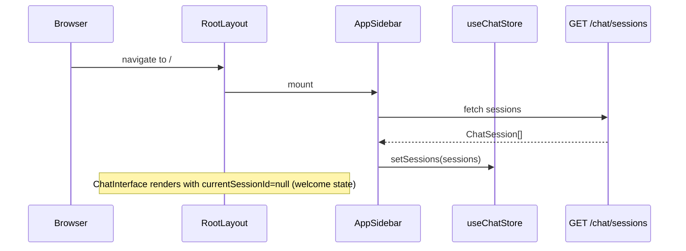

<Callout type="abstract">
Root page of DocRAG. Renders the main chat interface. No session is pre-selected — the user either picks an existing session from the sidebar or creates a new one.
</Callout>

---

## Route

| Property | Value |
| :--- | :--- |
| **Path** | `/` |
| **File** | `frontend/src/app/page.tsx` |
| **Auth Required** | No |
| **Layout** | `frontend/src/app/layout.tsx` — `ThemeProvider` → `SidebarProvider` → `AppSidebar` + `{children}` |
| **Dynamic Segment** | None |

---

## Component Tree

```
RootLayout (layout.tsx)
└── ThemeProvider
    └── SidebarProvider
        ├── AppSidebar            ← session list, new chat button, model selector
        └── SidebarInset          ← page.tsx renders here
            └── ChatInterface     ← message list + input + knowledge base panel
```

---

## Data Layer

### Global State — Zustand

| Store | Fields Read | Actions Called |
| :--- | :--- | :--- |
| `useChatStore` | `currentSessionId`, `sessions`, `selectedProvider`, `selectedModel` | `setCurrentSessionId`, `addSession`, `setSessions` |

### Local State (within ChatInterface)

| Variable | Type | Purpose |
| :--- | :--- | :--- |
| `messages` | `Message[]` | Current session message list |
| `isStreaming` | `boolean` | SSE stream in progress |
| `inputValue` | `string` | Controlled textarea value |

---

## Page Lifecycle



---

## Render Conditions

| Condition | Result |
| :--- | :--- |
| `currentSessionId === null` | `ChatInterface` shows empty/welcome state |
| `currentSessionId` set | `ChatInterface` loads and displays message history |
| `isStreaming === true` | Input disabled; streaming indicator shown |

---

## 🗂️ Related

| Role | Link |
| :--- | :--- |
| Global store | [Store - ChatStore](/en/docs/docrag/frontend/stores/store-chatstore) |
| Sibling page | [Page - Chat Session](/en/docs/docrag/frontend/pages/page-chat-session) |
| Settings page | [Page - Settings](/en/docs/docrag/frontend/pages/page-settings) |
| Chat session API | `API-GET-v1-chat-sessions` |
