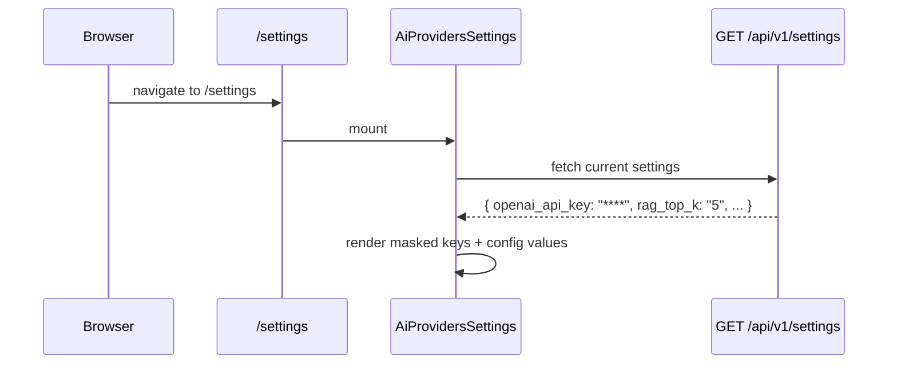

<Callout type="abstract">
Settings dashboard for configuring AI providers (API keys, active model), RAG parameters (top-k, score threshold), storage management (clear vector DB / chat history), and UI preferences. All settings persist to the `appsetting` PostgreSQL table via `PUT /api/v1/settings`.
</Callout>

---

## Route

| Property | Value |
| :--- | :--- |
| **Path** | `/settings` |
| **File** | `frontend/src/app/settings/page.tsx` |
| **Auth Required** | No |
| **Layout** | `frontend/src/app/layout.tsx` |
| **Dynamic Segment** | None |

---

## Component Tree

```
RootLayout (layout.tsx)
└── ThemeProvider
    └── SidebarProvider
        ├── AppSidebar
        └── SidebarInset
            └── header (h-12, border-b)   ← "Settings" title
                └── div.max-w-2xl.space-y-6
                    ├── AiProvidersSettings   ← provider selector + API keys + test connection
                    ├── RagSettings           ← top_k, score_threshold inputs
                    ├── StorageSettings       ← clear vector DB, clear chat history
                    └── PreferencesSettings   ← UI preferences (theme, etc.)
```

---

## Data Layer

### Server State (per component)

| Component | Endpoint | Purpose |
| :--- | :--- | :--- |
| `AiProvidersSettings` | `GET /api/v1/settings`, `PUT /api/v1/settings`, `POST /api/v1/settings/test-connection` | Load/save API keys + test connectivity |
| `RagSettings` | `GET /api/v1/settings`, `PUT /api/v1/settings` | Load/save `rag_top_k`, `rag_score_threshold` |
| `StorageSettings` | `DELETE /api/v1/data/vector`, `DELETE /api/v1/data/chat` | Clear vector store or chat history |
| `PreferencesSettings` | Local only (`ThemeProvider`) | No API calls — theme stored in browser |

### Local State (within setting components)

| Variable | Type | Purpose |
| :--- | :--- | :--- |
| `isSaving` | `boolean` | Disable save button during PUT request |
| `isTesting` | `boolean` | Disable test button during POST request |
| `isClearing` | `boolean` | Disable clear button during DELETE request |

---

## Page Lifecycle



---

## Render Conditions

| Condition | Result |
| :--- | :--- |
| API key has a saved value | Input shows `"****"` — never plaintext |
| `isTesting === true` | "Test Connection" button shows spinner |
| Storage clear triggered | Confirmation dialog before `DELETE` |

---

## 🗂️ Related

| Role | Link |
| :--- | :--- |
| Settings API (read) | `API-GET-v1-settings` |
| Settings API (write) | `API-PUT-v1-settings` |
| Connection test API | `API-POST-v1-settings-test-connection` |
| Storage clear API | `API-DELETE-v1-data-vector`, `API-DELETE-v1-data-chat` |
| Settings DB table | [DB - appsetting](/en/docs/docrag/database/db-appsetting) |
