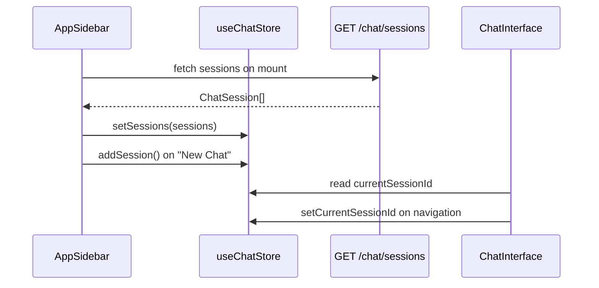

<Callout type="abstract">
Global Zustand store for chat session management and LLM model selection. Persists `selectedProvider` and `selectedModel` to `localStorage` so the user's model choice survives page refresh. Session list (`sessions`) is also persisted, giving the sidebar instant render without a network round-trip.
</Callout>

---

## File

`frontend/src/hooks/use-chat-store.ts`

---

## State Shape

```typescript
interface ChatState {
  // Session management
  currentSessionId: string | null;
  sessions: ChatSession[];
  setCurrentSessionId: (id: string | null) => void;
  setSessions: (sessions: ChatSession[]) => void;
  addSession: (session: ChatSession) => void;
  removeSession: (id: string) => void;
  updateSessionTitle: (id: string, title: string) => void;

  // LLM model selection (persisted to localStorage)
  selectedProvider: string;
  selectedModel: string;
  setSelectedProvider: (provider: string) => void;
  setSelectedModel: (model: string) => void;
}
```

---

## State Fields

| Field | Type | Initial | Persisted | Description |
| :--- | :--- | :--- | :--- | :--- |
| `currentSessionId` | `string \| null` | `null` | Yes | UUID of the active chat session |
| `sessions` | `ChatSession[]` | `[]` | Yes | Ordered list (newest first) from `GET /api/v1/chat/sessions` |
| `selectedProvider` | `string` | — | Yes | Active LLM provider (`"ollama"`, `"openai"`, etc.) |
| `selectedModel` | `string` | — | Yes | Model name sent in `ask-stream` query params |

`ChatSession` type from `frontend/src/types/chat.ts`:
```typescript
interface ChatSession {
  id: string;
  title: string;
  provider: string;
  model_name: string;
  created_at: string;
}
```

---

## Actions

| Action | Signature | Side Effects |
| :--- | :--- | :--- |
| `setCurrentSessionId` | `(id: string \| null) => void` | Navigates sidebar highlight |
| `setSessions` | `(sessions: ChatSession[]) => void` | Replaces full session list |
| `addSession` | `(session: ChatSession) => void` | Prepends + sets `currentSessionId` to new session |
| `removeSession` | `(id: string) => void` | Filters list; nullifies `currentSessionId` if it matched |
| `updateSessionTitle` | `(id: string, title: string) => void` | Updates title in-place in `sessions` array |
| `setSelectedProvider` | `(provider: string) => void` | Persisted immediately to localStorage |
| `setSelectedModel` | `(model: string) => void` | Persisted immediately to localStorage |

---

## Persistence

Uses `zustand/middleware persist`. All state is serialized to `localStorage`. Key: default Zustand persist key derived from store definition order.

<Callout type="warning">
`sessions` in localStorage can diverge from the server if sessions are created/deleted from another tab or device. `app-sidebar.tsx` re-fetches `GET /api/v1/chat/sessions` on mount and calls `setSessions()` to reconcile.
</Callout>

---

## Data Flow



---

## Consumers

| Component | What it reads | What it calls |
| :--- | :--- | :--- |
| `frontend/src/components/app-sidebar.tsx` | `sessions`, `currentSessionId` | `addSession`, `removeSession`, `setSessions`, `setCurrentSessionId` |
| `frontend/src/components/chat/chat-interface.tsx` | `currentSessionId`, `selectedProvider`, `selectedModel` | `setCurrentSessionId` |
| `frontend/src/components/chat/model-selector.tsx` | `selectedProvider`, `selectedModel` | `setSelectedProvider`, `setSelectedModel` |
| `frontend/src/components/nav-session.tsx` | `sessions`, `currentSessionId` | `updateSessionTitle`, `removeSession` |

---

## 🗂️ Related

| Role | Link |
| :--- | :--- |
| Frontend page consuming this store | [Page - Home](/en/docs/docrag/frontend/pages/page-home) |
| Chat session API | `API-GET-v1-chat-sessions` |
| TypeScript types | `frontend/src/types/chat.ts` |
