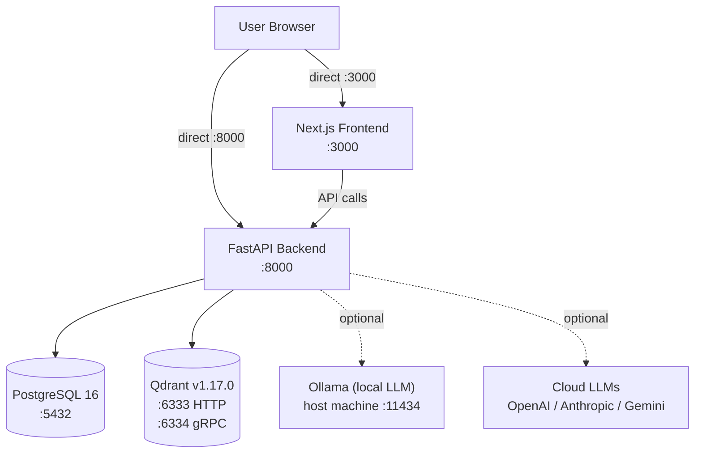

<Callout type="abstract">
Deployment architecture, services, environment variables, and operational runbooks for DocRAG — a self-hosted multimodal RAG engine.
</Callout>

## Services Map



<Callout type="note">
DocRAG exposes services on individual ports directly. There is no nginx or API gateway — the frontend calls the backend at `http://localhost:8000` directly.
</Callout>

---

## Docker Services

| Service | Container | Image | Port(s) | Volume | Purpose |
| :--- | :--- | :--- | :--- | :--- | :--- |
| `postgres` | `docrag-postgres` | `postgres:16-alpine` | `5432` | `./postgres_data:/var/lib/postgresql/data` | Chat session + message persistence |
| `qdrant` | `docrag-vector-db` | `qdrant/qdrant:v1.17.0` | `6333` (HTTP), `6334` (gRPC) | `./qdrant_data:/qdrant/storage:z` | Vector storage for document chunks |
| `backend` | `docrag-api` | custom build | `8000` | `./backend:/app` + named `backend_venv` | FastAPI API server (hot-reload enabled) |
| `frontend` | `docrag-ui` | custom build | `3000` | `./frontend:/app` + named `frontend_node_modules` | Next.js UI (hot-reload via `npm run dev`) |

**Startup order:** `qdrant` → `postgres` (both health-checked) → `backend` → `frontend`

Health checks:
- `postgres`: `pg_isready -U postgres` (10s interval, 5 retries)
- `qdrant`: `cat /proc/net/tcp | grep 18BD` (hex port 6333; 10s interval, 3 retries)

---

## Environment Variables

| Variable | Required | Source | Description | Default |
| :--- | :--- | :--- | :--- | :--- |
| `POSTGRES_USER` | Yes | postgres image | DB superuser name | `postgres` |
| `POSTGRES_PASSWORD` | Yes | postgres image | DB superuser password | `password` |
| `POSTGRES_DB` | Yes | postgres image | Database name | `docrag_db` |
| `DB__USER` | Yes | pydantic-settings | Must match `POSTGRES_USER` | `postgres` |
| `DB__PASSWORD` | Yes | pydantic-settings | Must match `POSTGRES_PASSWORD` | `password` |
| `DB__HOST` | Yes | pydantic-settings | `postgres` (service name in Docker) | `localhost` |
| `DB__PORT` | No | pydantic-settings | PostgreSQL port | `5432` |
| `DB__NAME` | Yes | pydantic-settings | Must match `POSTGRES_DB` | `docrag_db` |
| `QDRANT__HOST` | No | pydantic-settings | `qdrant` (service name in Docker) | `qdrant` |
| `QDRANT__PORT` | No | pydantic-settings | Qdrant HTTP API port | `6333` |
| `QDRANT__COLLECTION_NAME` | No | pydantic-settings | Vector collection name | `doc_rag_knowledge` |
| `LLM__PROVIDER` | No | pydantic-settings | Active LLM backend | `ollama` |
| `LLM__OLLAMA_BASE_URL` | No | pydantic-settings | Ollama server URL | `http://localhost:11434` |
| `LLM__OPENAI_API_KEY` | No | pydantic-settings | OpenAI API key | `null` |
| `LLM__ANTHROPIC_API_KEY` | No | pydantic-settings | Anthropic API key | `null` |
| `LLM__GEMINI_API_KEY` | No | pydantic-settings | Google Gemini API key | `null` |

<Callout type="warning">
PostgreSQL Docker image uses `POSTGRES_*` variables. pydantic-settings reads `DB__*` with `__` as nested delimiter (→ `Settings.DB`). Both sets must be kept in sync in `.env`.
</Callout>

<Callout type="warning">
Changing `EMBED_MODEL` (default: `nomic-ai/nomic-embed-text-v1.5`, 768 dims) after indexing data requires clearing the Qdrant collection. `nomic` vectors are 768-dim; the old default `sentence-transformers/all-MiniLM-L6-v2` is 384-dim — mixing them will corrupt search.
</Callout>

---

## Nginx Routing Rules

Not applicable — DocRAG does not use a reverse proxy. Ports are exposed directly.

---

## Deployment Procedure

### Full Stack (Docker Compose — recommended)

```bash
cp .env.example .env
# Edit .env with your passwords and API keys
docker-compose up --build
```

- Frontend UI: `http://localhost:3000`
- Backend API + Swagger: `http://localhost:8000/docs`
- Qdrant Dashboard: `http://localhost:6333/dashboard`

### With Local LLM (Ollama)

Set `LLM__PROVIDER=ollama` and `LLM__OLLAMA_BASE_URL=http://host.docker.internal:11434` in `.env`. Ollama must be running on the host machine. The `host.docker.internal` DNS name resolves to the host from inside Docker containers.

### Backend Only (Local Dev)

```bash
cd backend
uv sync
docker-compose up -d qdrant postgres   # still need the data stores
uv run uvicorn app.main:app --reload --port 8000
```

### Frontend Only (Local Dev)

```bash
cd frontend
npm install
npm run dev
```

---

## Backup & Restore

| Data | Location | Notes |
| :--- | :--- | :--- |
| Chat history (PostgreSQL) | `./postgres_data/` | Copy entire directory while container is stopped |
| Vector index (Qdrant) | `./qdrant_data/` | Copy entire directory while container is stopped |

<Callout type="warning">
DocRAG does not ship backup scripts. For production use, snapshot the `postgres_data` and `qdrant_data` bind-mount directories out-of-band.
</Callout>

---

## Security Considerations

- API keys (OpenAI, Anthropic, Gemini) are stored in `AppSetting` table (PostgreSQL) and returned **masked** via the settings API — see `backend/app/api/v1/settings.py`.
- No authentication layer — DocRAG is designed for local/self-hosted use. Do not expose ports 3000 or 8000 to the public internet without adding auth.
- CORS is configured in `backend/app/main.py` via `CORSMiddleware`.

---

## Known Gotchas

- **`DB__HOST` must be `postgres`** (service name) in Docker, but `localhost` for local dev. Failing to change this breaks the backend on startup.
- **`backend_venv` named volume** caches the Python virtualenv; if you change `pyproject.toml`, run `docker-compose down -v` and rebuild to force a fresh `uv sync`.
- **Qdrant health check** uses `/proc/net/tcp` hex port detection (`18BD` = `6333` in hex) — not a curl because `curl` is not in the image.
- **File size limit:** `file_service.validate_file()` enforces 20 MB — hardcoded in `backend/app/services/file_service.py`.

---

## 🗂️ Related

| Role | Link |
| :--- | :--- |
| Chat DB schema | [DB - chatsession](/en/docs/docrag/database/db-chatsession) |
| Message DB schema | [DB - chatmessage](/en/docs/docrag/database/db-chatmessage) |
| Settings DB schema | [DB - appsetting](/en/docs/docrag/database/db-appsetting) |
