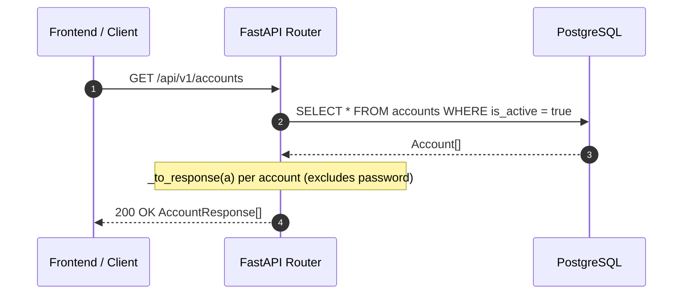

<Callout type="abstract">
Returns all active MT5 accounts — called on app startup to populate the account selector sidebar and the Accounts page.
</Callout>


## 🔒 Authentication

| Property | Value |
| :--- | :--- |
| **Mechanism** | None |
| **Required** | No |


## 🛠️ Technical Specification

### Request

| Parameter | Location | Type | Required | Description |
| :--- | :--- | :--- | :--- | :--- |
| — | — | — | — | No parameters |


### Logic Flow




### 📦 Request Body

None.


### 📤 Responses

| Status | When | Body |
| :--- | :--- | :--- |
| `200 OK` | Success | `AccountResponse[]` |
| `500 Internal Server Error` | DB unavailable | `{ "detail": "..." }` |

**200 OK example:**
```json
[
  {
    "id": 42,
    "name": "Live Trading Account",
    "broker": "MetaQuotes",
    "login": 12345678,
    "server": "MetaQuotes-Demo",
    "is_live": false,
    "is_active": true,
    "allowed_symbols": ["EURUSD", "GBPUSD"],
    "max_lot_size": 0.1,
    "risk_pct": 0.01,
    "auto_trade_enabled": true,
    "paper_trade_enabled": false,
    "mt5_path": "",
    "account_type": "USD",
    "created_at": "2026-04-15T10:00:00Z"
  }
]
```

**Note:** `password_encrypted` is never included in `AccountResponse`. Use `_to_response()` helper in router.

**Pydantic Schema:** `backend/api/routes/accounts.py :: AccountResponse`


### 🗂️ Related Files

| Role | Path |
| :--- | :--- |
| Router | `backend/api/routes/accounts.py :: list_accounts()` |
| DB Table | [DB - accounts](/en/docs/llmsystemtrading/database/db-accounts) |


## 🗂️ Related

| Role | Link |
| :--- | :--- |
| Related Endpoint | [API-POST-v1-Accounts](/en/docs/llmsystemtrading/api/accounts/api-post-v1-accounts) |
| Frontend Page | [Page - Accounts](/en/docs/llmsystemtrading/frontend/pages/page-accounts) |
| Store | [Store - TradingStore](/en/docs/llmsystemtrading/frontend/stores/store-tradingstore) |
| DB Schema | [DB - accounts](/en/docs/llmsystemtrading/database/db-accounts) |
