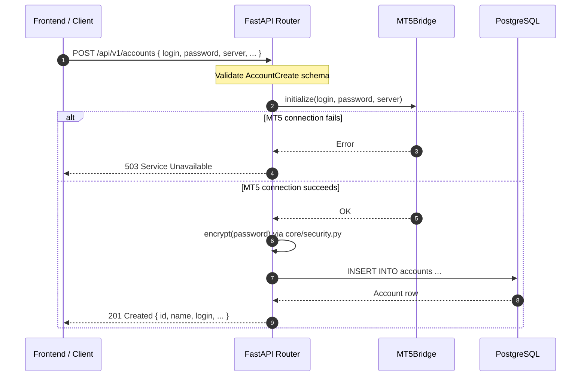

<Callout type="abstract">
Register a new MetaTrader5 account — verifies credentials against MT5, encrypts the password, stores the account, and returns the created record.
</Callout>


## 🔒 Authentication

| Property | Value |
| :--- | :--- |
| **Mechanism** | None |
| **Required** | No |


## 🛠️ Technical Specification

### Request

| Parameter | Location | Type | Required | Description |
| :--- | :--- | :--- | :--- | :--- |
| `name` | Body | `string` (max 100) | Yes | Human-readable account label |
| `broker` | Body | `string` (max 100) | Yes | Broker name |
| `login` | Body | `integer` (> 0) | Yes | MT5 account number |
| `password` | Body | `string` | Yes | MT5 password (encrypted before storage) |
| `server` | Body | `string` (max 200) | Yes | MT5 server string |
| `is_live` | Body | `boolean` | No | True = live account (default: `false`) |
| `allowed_symbols` | Body | `string[]` | No | Permitted symbols (default: `[]`) |
| `max_lot_size` | Body | `float` (0–100) | No | Max trade volume in lots (default: `0.1`) |
| `risk_pct` | Body | `float` (0–1) | No | Risk per trade as fraction (default: `0.01` = 1%) |
| `auto_trade_enabled` | Body | `boolean` | No | Enable automated trading (default: `true`) |
| `mt5_path` | Body | `string` (max 500) | No | Path to `terminal64.exe` (overrides global) |
| `account_type` | Body | `"USD" \| "USC"` | No | Account currency type (default: `"USD"`) |

**Pydantic Schema:** `backend/api/routes/accounts.py :: AccountCreate`


### Logic Flow




### 📦 Request Body

```json
{
  "name": "Live Trading Account",
  "broker": "MetaQuotes",
  "login": 12345678,
  "password": "MyMT5Password",
  "server": "MetaQuotes-Demo",
  "is_live": false,
  "allowed_symbols": ["EURUSD", "GBPUSD"],
  "max_lot_size": 0.1,
  "risk_pct": 0.01,
  "auto_trade_enabled": true,
  "account_type": "USD"
}
```


### 📤 Responses

| Status | When | Body |
| :--- | :--- | :--- |
| `201 Created` | Account registered | `AccountResponse` |
| `400 Bad Request` | Invalid credentials or validation error | `{ "detail": "message" }` |
| `409 Conflict` | Login already registered | `{ "detail": "Account 12345678 already exists" }` |
| `422 Unprocessable Entity` | Pydantic schema error | `{ "detail": [...] }` |
| `503 Service Unavailable` | MT5 connection failed | `{ "detail": "MT5 connection failed; try again later" }` |

**201 Created example:**
```json
{
  "id": 42,
  "name": "Live Trading Account",
  "broker": "MetaQuotes",
  "login": 12345678,
  "server": "MetaQuotes-Demo",
  "is_live": false,
  "is_active": true,
  "allowed_symbols": ["EURUSD", "GBPUSD"],
  "max_lot_size": 0.1,
  "risk_pct": 0.01,
  "auto_trade_enabled": true,
  "paper_trade_enabled": false,
  "mt5_path": "",
  "account_type": "USD",
  "created_at": "2026-05-16T14:30:00Z"
}
```

**Pydantic Schema:** `backend/api/routes/accounts.py :: AccountResponse`


### 🗂️ Related Files

| Role | Path |
| :--- | :--- |
| Router | `backend/api/routes/accounts.py` |
| MT5 Bridge | `backend/mt5/bridge.py` |
| Security | `backend/core/security.py :: encrypt()` |
| DB Table | [DB - accounts](/en/docs/llmsystemtrading/database/db-accounts) |


## 🗂️ Related

| Role | Link |
| :--- | :--- |
| Related Endpoint | [API-GET-v1-Accounts](/en/docs/llmsystemtrading/api/accounts/api-get-v1-accounts) |
| Frontend Page | [Page - Accounts](/en/docs/llmsystemtrading/frontend/pages/page-accounts) |
| DB Schema | [DB - accounts](/en/docs/llmsystemtrading/database/db-accounts) |
