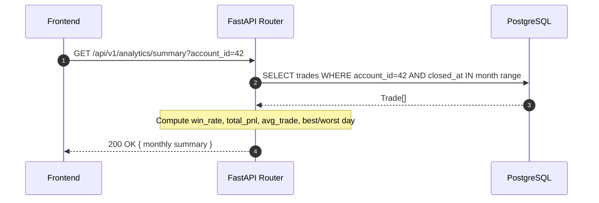

<Callout type="abstract">
Returns trading performance analytics — monthly stats summary and daily P&L breakdown — used by the Analytics page to render the P&L calendar and monthly statistics.
</Callout>

## 🔒 Authentication

| Property | Value |
| :--- | :--- |
| **Mechanism** | None |
| **Required** | No |

## Endpoints in this group

| Method | Path | Description |
| :--- | :--- | :--- |
| `GET` | `/api/v1/analytics/summary` | Monthly statistics for active account |
| `GET` | `/api/v1/analytics/daily` | Daily P&L entries for calendar view |

---

## GET /api/v1/analytics/summary

> Aggregated monthly performance metrics — win rate, total P&L, average trade — for the active account.

### Request

| Parameter | Location | Type | Required | Description |
| :--- | :--- | :--- | :--- | :--- |
| `account_id` | Query | `integer` | Yes | Active account ID |
| `year` | Query | `integer` | No | Year filter (default: current year) |
| `month` | Query | `integer` | No | Month filter (default: current month) |

### Logic Flow



### 📤 Responses

| Status | When | Body |
| :--- | :--- | :--- |
| `200 OK` | Success | Monthly summary object |
| `404 Not Found` | Account not found | `{ "detail": "Account not found" }` |

**200 OK example:**
```json
{
  "year": 2026,
  "month": 5,
  "total_trades": 42,
  "winning_trades": 28,
  "losing_trades": 14,
  "win_rate": 0.667,
  "total_pnl": 1250.50,
  "avg_win": 85.20,
  "avg_loss": -42.10,
  "profit_factor": 2.02,
  "best_day": "2026-05-08",
  "worst_day": "2026-05-15"
}
```

---

## GET /api/v1/analytics/daily

> Per-day P&L entries for rendering the calendar heatmap.

### Request

| Parameter | Location | Type | Required | Description |
| :--- | :--- | :--- | :--- | :--- |
| `account_id` | Query | `integer` | Yes | Active account ID |
| `year` | Query | `integer` | No | Year (default: current) |
| `month` | Query | `integer` | No | Month (default: current) |

**Pydantic Schema:** `backend/api/routes/analytics.py :: DailyPnLResponse`

**200 OK example:**
```json
{
  "entries": {
    "2026-05-01": { "pnl": 125.50, "trades": 3, "win_rate": 1.0 },
    "2026-05-02": { "pnl": -45.20, "trades": 2, "win_rate": 0.5 },
    "2026-05-08": { "pnl": 380.00, "trades": 5, "win_rate": 0.8 }
  }
}
```

---

### 🗂️ Related Files

| Role | Path |
| :--- | :--- |
| Router | `backend/api/routes/analytics.py` |
| DB Table | [DB - trades](/en/docs/llmsystemtrading/database/db-trades) |

## 🗂️ Related

| Role | Link |
| :--- | :--- |
| Frontend Page | [Page - Analytics](/en/docs/llmsystemtrading/frontend/pages/page-analytics) |
| DB Schema | [DB - trades](/en/docs/llmsystemtrading/database/db-trades) |
