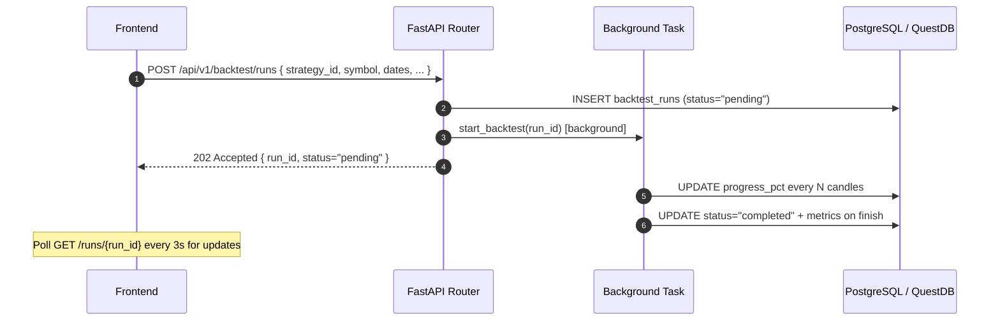

<Callout type="abstract">
Create and monitor LLM-driven backtests and parameter optimization runs — 20 endpoints covering run lifecycle, chart data, analytics breakdowns, and CSV data upload.
</Callout>

## 🔒 Authentication

| Property | Value |
| :--- | :--- |
| **Mechanism** | None |
| **Required** | No |

## Endpoints in this group (20 total)

| Method | Path | Description |
| :--- | :--- | :--- |
| `POST` | `/api/v1/backtest/runs` | Create and start a new backtest run |
| `GET` | `/api/v1/backtest/runs` | List all backtest runs (last 50) |
| `GET` | `/api/v1/backtest/runs/{run_id}` | Get run detail + metrics |
| `GET` | `/api/v1/backtest/runs/{run_id}/trades` | List trades in this run |
| `GET` | `/api/v1/backtest/runs/{run_id}/equity-curve` | Equity curve data points |
| `GET` | `/api/v1/backtest/runs/{run_id}/drawdown` | Drawdown chart data |
| `GET` | `/api/v1/backtest/runs/{run_id}/candles` | OHLCV candle replay data |
| `GET` | `/api/v1/backtest/runs/{run_id}/monthly-pnl` | Monthly P&L breakdown |
| `DELETE` | `/api/v1/backtest/runs/{run_id}` | Delete run + its trades |
| `POST` | `/api/v1/backtest/data/upload` | Upload CSV candle data for offline backtest |
| `GET` | `/api/v1/backtest/runs/{run_id}/analytics` | Summary analytics for run |
| `GET` | `/api/v1/backtest/runs/{run_id}/analytics/groups` | Trade group analysis |
| `GET` | `/api/v1/backtest/runs/{run_id}/analytics/heatmap` | Symbol/timeframe heatmap |
| `GET` | `/api/v1/backtest/runs/{run_id}/analytics/combinations` | Combinations breakdown |
| `POST` | `/api/v1/backtest/optimize` | Start optimization run |
| `GET` | `/api/v1/backtest/optimize` | List optimization runs |
| `GET` | `/api/v1/backtest/optimize/{opt_id}` | Get optimization run detail |
| `POST` | `/api/v1/backtest/optimize/{opt_id}/cancel` | Cancel running optimization |
| `POST` | `/api/v1/backtest/optimize/{opt_id}/resume` | Resume cancelled optimization |
| `GET` | `/api/v1/backtest/optimize/{opt_id}/results` | Get ranked results |

---

## POST /api/v1/backtest/runs

> Create a new backtest and start executing it asynchronously. Returns immediately with `status="pending"`.

### Logic Flow



### 📦 Request Body

```json
{
  "strategy_id": 3,
  "symbol": "EURUSD",
  "timeframe": "H1",
  "start_date": "2026-01-01T00:00:00Z",
  "end_date": "2026-04-30T00:00:00Z",
  "initial_balance": 10000.0,
  "spread_pips": 1.5,
  "execution_mode": "close_price",
  "max_llm_calls": 200
}
```

**Status:** `202 Accepted`

---

## GET /api/v1/backtest/runs/{run_id}

> Poll this endpoint every 3s while `status in ("pending", "running")` to track progress.

**200 OK example:**
```json
{
  "id": 77,
  "strategy_id": 3,
  "symbol": "EURUSD",
  "status": "completed",
  "progress_pct": 100,
  "total_trades": 38,
  "win_rate": 0.632,
  "sharpe_ratio": 1.85,
  "max_drawdown_pct": 8.4,
  "total_return_pct": 12.6,
  "profit_factor": 1.94,
  "data_file_path": "uploads/bt_77_EURUSD_H1.csv"
}
```

---

## POST /api/v1/backtest/optimize

> Start a parameter grid search. Runs `N combinations × backtest` in parallel using `max_workers` threads.

**Request body example:**
```json
{
  "strategy_id": 3,
  "symbol": "EURUSD",
  "timeframe": "H1",
  "start_date": "2026-01-01T00:00:00Z",
  "end_date": "2026-03-31T00:00:00Z",
  "param_grid": {
    "sl_pips": [20, 30, 40],
    "tp_pips": [40, 60, 80],
    "confidence_threshold": [0.6, 0.7, 0.8]
  },
  "optimize_metric": "sharpe_ratio",
  "max_workers": 4
}
```

**Note:** `3 × 3 × 3 = 27 combinations`. Each combination runs a full backtest. The system tracks `completed_combinations / total_combinations` in `optimization_runs.progress_pct`.

---

## POST /api/v1/backtest/data/upload

> Upload a CSV file of OHLCV candle data for use in offline backtesting (no MT5 required).

**Content-Type:** `multipart/form-data`  
**File format:** `datetime,open,high,low,close,volume`

---

### 🗂️ Related Files

| Role | Path |
| :--- | :--- |
| Router | `backend/api/routes/backtest.py` |
| DB Table | [DB - backtest_runs](/en/docs/llmsystemtrading/database/db-backtest-runs) |
| DB Table | [DB - optimization_runs](/en/docs/llmsystemtrading/database/db-optimization-runs) |

## 🗂️ Related

| Role | Link |
| :--- | :--- |
| Frontend Page | [Page - Backtest](/en/docs/llmsystemtrading/frontend/pages/page-backtest) |
| DB Schema | [DB - backtest_runs](/en/docs/llmsystemtrading/database/db-backtest-runs) |
| DB Schema | [DB - optimization_runs](/en/docs/llmsystemtrading/database/db-optimization-runs) |
| DB Schema | [DB - strategies](/en/docs/llmsystemtrading/database/db-strategies) |
