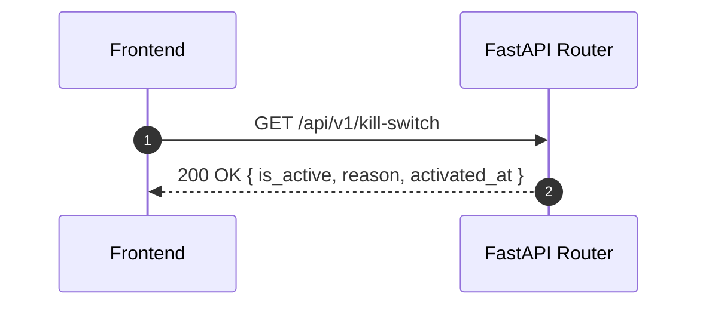

<Callout type="abstract">
Emergency trading halt — activate to immediately stop all automated trading across all accounts; deactivate to resume. Maintains an audit log of all activations.
</Callout>

## 🔒 Authentication

| Property | Value |
| :--- | :--- |
| **Mechanism** | None |
| **Required** | No |

## Endpoints in this group (4 total)

| Method | Path | Description |
| :--- | :--- | :--- |
| `GET` | `/api/v1/kill-switch` | Get current kill-switch status |
| `POST` | `/api/v1/kill-switch/activate` | Activate kill switch (halt trading) |
| `POST` | `/api/v1/kill-switch/deactivate` | Deactivate kill switch (resume trading) |
| `GET` | `/api/v1/kill-switch/logs` | Audit log of all activations |

---

## GET /api/v1/kill-switch

> Returns current kill-switch state — whether trading is halted, the reason, and when it was activated.

### Logic Flow



**200 OK example:**
```json
{
  "is_active": true,
  "reason": "Unexpected drawdown spike — manual halt",
  "activated_at": "2026-05-16T14:30:00Z",
  "activated_by": "manual"
}
```

---

## POST /api/v1/kill-switch/activate

> Immediately halts all automated trading. All future scheduler jobs will check `is_active` and skip execution.

**Request body:**
```json
{
  "reason": "High-impact news event — NFP release"
}
```

**Effect on scheduler:** Every scheduled analysis job checks the kill-switch at the start. If `is_active=True`, the job returns early without calling MT5 or LLM.

---

## POST /api/v1/kill-switch/deactivate

> Re-enables automated trading. Next scheduled run will proceed normally.

**Request body:** None required.

---

## GET /api/v1/kill-switch/logs

> Returns chronological list of kill-switch events (activations + deactivations).

**200 OK example:**
```json
[
  {
    "id": 5,
    "action": "activate",
    "reason": "Manual halt",
    "timestamp": "2026-05-16T14:30:00Z"
  },
  {
    "id": 6,
    "action": "deactivate",
    "reason": null,
    "timestamp": "2026-05-16T16:00:00Z"
  }
]
```

**Pydantic Schema:** `backend/api/routes/kill_switch.py :: KillSwitchLogResponse`

---

### 🗂️ Related Files

| Role | Path |
| :--- | :--- |
| Router | `backend/api/routes/kill_switch.py` |
| Store | [Store - TradingStore](/en/docs/llmsystemtrading/frontend/stores/store-tradingstore) (`killSwitch` field) |

## 🗂️ Related

| Role | Link |
| :--- | :--- |
| Frontend Page | [Page - Kill Switch](/en/docs/llmsystemtrading/frontend/pages/page-kill-switch) |
| Store | [Store - TradingStore](/en/docs/llmsystemtrading/frontend/stores/store-tradingstore) |
