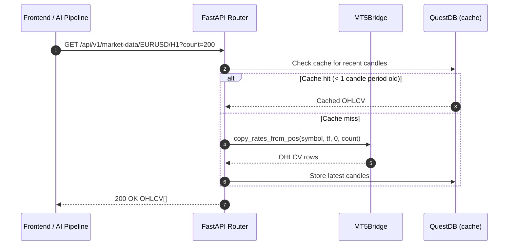

<Callout type="abstract">
Fetch live OHLCV candle data from MT5 for a given symbol and timeframe — used by the Chart page and LLM analysis pipeline to get current price data.
</Callout>

## 🔒 Authentication

| Property | Value |
| :--- | :--- |
| **Mechanism** | None |
| **Required** | No |

## 🛠️ Technical Specification

### Request

| Parameter | Location | Type | Required | Description |
| :--- | :--- | :--- | :--- | :--- |
| `symbol` | Path | `string` | Yes | Trading pair (e.g., `EURUSD`, `XAUUSD`) |
| `timeframe` | Path | `string` | Yes | Candle timeframe: `M1`, `M5`, `M15`, `M30`, `H1`, `H4`, `D1` |
| `count` | Query | `integer` | No | Number of candles (default: 100) |
| `account_id` | Query | `integer` | No | Account to use for MT5 connection |

### Logic Flow



### 📤 Responses

**200 OK example:**
```json
[
  {
    "time": "2026-05-16T14:00:00Z",
    "open": 1.08520,
    "high": 1.08650,
    "low": 1.08480,
    "close": 1.08610,
    "tick_volume": 1842,
    "spread": 1
  }
]
```

### 🗂️ Related Files

| Role | Path |
| :--- | :--- |
| Router | `backend/api/routes/market_data.py` |
| MT5 Bridge | `backend/mt5/bridge.py` |
| QuestDB | `backend/db/questdb.py` |

## 🗂️ Related

| Role | Link |
| :--- | :--- |
| Frontend Page | [Page - Chart](/en/docs/llmsystemtrading/frontend/pages/page-chart) |
| Infrastructure | [DevOps - LLMSystemTrading](/en/docs/llmsystemtrading/devops/devops-llmsystemtrading) |
