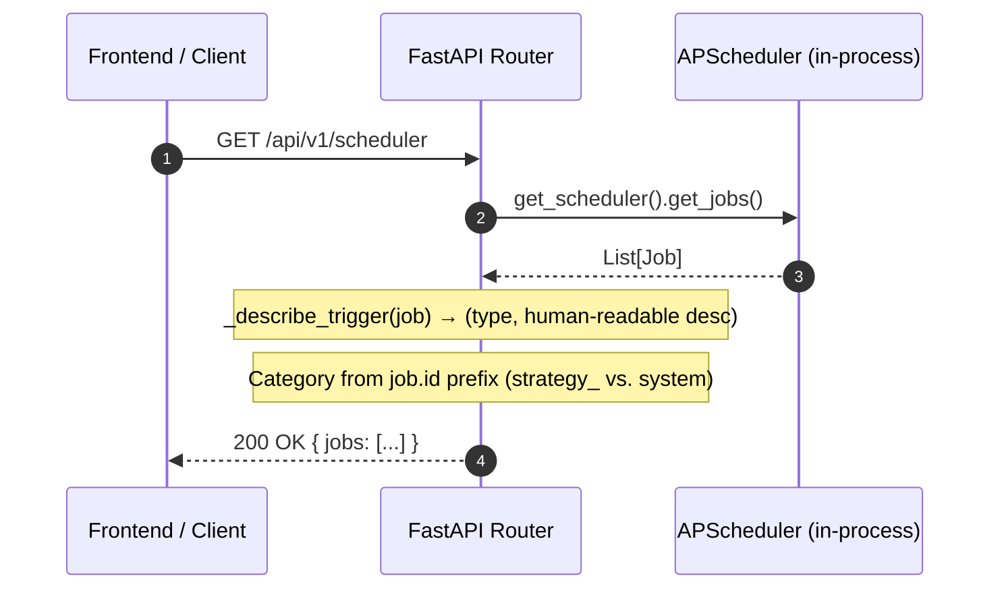

<Callout type="abstract">
Returns all registered APScheduler jobs with human-readable trigger descriptions, next/last run times, and error status — used by the Schedule page to display live countdowns.
</Callout>


## 🔒 Authentication

| Property | Value |
| :--- | :--- |
| **Mechanism** | None |
| **Required** | No |


## 🛠️ Technical Specification

### Request

| Parameter | Location | Type | Required | Description |
| :--- | :--- | :--- | :--- | :--- |
| — | — | — | — | No parameters |


### Logic Flow




### 📦 Request Body

None.


### 📤 Responses

| Status | When | Body |
| :--- | :--- | :--- |
| `200 OK` | Success | `ScheduledJob[]` |
| `500 Internal Server Error` | Scheduler unavailable | `{ "detail": "..." }` |

**200 OK example:**
```json
[
  {
    "id": "h1_candle_analysis",
    "name": "H1 Candle Analysis — EURUSD",
    "next_run_time": "2026-05-16T19:00:00+00:00",
    "trigger_type": "cron",
    "trigger_desc": "Every 1h on the hour (H1 candle)",
    "category": "strategy",
    "enabled": true,
    "last_run_time": "2026-05-16T18:00:00+00:00",
    "error_message": null
  },
  {
    "id": "maintenance_task",
    "name": "Position Maintenance",
    "next_run_time": "2026-05-16T18:15:00+00:00",
    "trigger_type": "interval",
    "trigger_desc": "Every 15 min",
    "category": "system",
    "enabled": true,
    "last_run_time": "2026-05-16T18:00:00+00:00",
    "error_message": null
  }
]
```

**Field descriptions:**
- `trigger_type`: `"cron"` or `"interval"`
- `trigger_desc`: Human-readable (from `_describe_trigger()`)
  - `"Every 1h on the hour (H1 candle)"`
  - `"Every 15 min (M15 candle)"`
  - `"Daily at 15:30"`
  - `"Weekly on MON at 08:00 UTC"`
- `category`: `"strategy"` (from account binding) or `"system"` (maintenance, research)
- `next_run_time`: ISO 8601 UTC; `null` if job will never fire again
- `enabled`: `false` if job is paused in scheduler


### 🗂️ Related Files

| Role | Path |
| :--- | :--- |
| Router | `backend/api/routes/scheduler.py` |
| Service | `backend/services/scheduler.py :: get_scheduler()` |
| Position Maintenance | `backend/services/position_maintenance.py` |


## 🗂️ Related

| Role | Link |
| :--- | :--- |
| Related Endpoint | [API-POST-v1-Scheduler-Trigger](API-POST-v1-Scheduler-Trigger) |
| Frontend Page | [Page - Schedule](/en/docs/llmsystemtrading/frontend/pages/page-schedule) |
| DB Schema | [DB - strategies](/en/docs/llmsystemtrading/database/db-strategies) |
| DB Schema | [DB - account_strategy](/en/docs/llmsystemtrading/database/db-account-strategy) |
