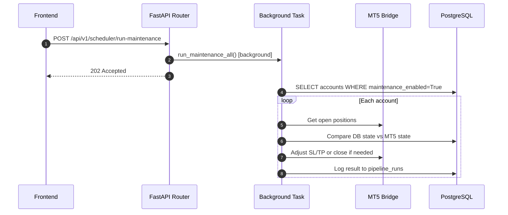

<Callout type="abstract">
Manually trigger position maintenance for all accounts, a specific account, or a specific trade ticket — checks open positions against MT5 state and takes corrective action (close, adjust SL/TP, or alert).
</Callout>

## 🔒 Authentication

| Property | Value |
| :--- | :--- |
| **Mechanism** | None |
| **Required** | No |

## Endpoints in this group (scheduler sub-routes)

| Method | Path | Description |
| :--- | :--- | :--- |
| `POST` | `/api/v1/scheduler/run-maintenance` | Run maintenance for ALL active accounts |
| `POST` | `/api/v1/scheduler/run-maintenance/{account_id}` | Run maintenance for one account |
| `POST` | `/api/v1/scheduler/run-maintenance/{account_id}/ticket/{ticket}` | Run maintenance for one specific trade |

All return `202 Accepted` — maintenance runs as a background task.

---

## POST /api/v1/scheduler/run-maintenance

> Fires the `PositionMaintenanceService` for all accounts where `maintenance_task_enabled=True`.

### Logic Flow

**Status:** `202 Accepted`

---

## POST /api/v1/scheduler/run-maintenance/{account_id}/ticket/{ticket}

> Most granular — run maintenance on one specific trade identified by MT5 ticket number.

**Use case:** LLM noticed an anomaly in one trade during a pipeline run and requests a manual check.

---

### 🗂️ Related Files

| Role | Path |
| :--- | :--- |
| Router | `backend/api/routes/scheduler.py` |
| Service | `backend/services/position_maintenance.py :: PositionMaintenanceService` |
| DB Table | [DB - pipeline_runs](/en/docs/llmsystemtrading/database/db-pipeline-runs) |

## 🗂️ Related

| Role | Link |
| :--- | :--- |
| Related Endpoint | [API-GET-v1-Scheduler](/en/docs/llmsystemtrading/api/scheduler/api-get-v1-scheduler) |
| Frontend Page | [Page - Schedule](/en/docs/llmsystemtrading/frontend/pages/page-schedule) |
| DB Schema | [DB - pipeline_runs](/en/docs/llmsystemtrading/database/db-pipeline-runs) |
