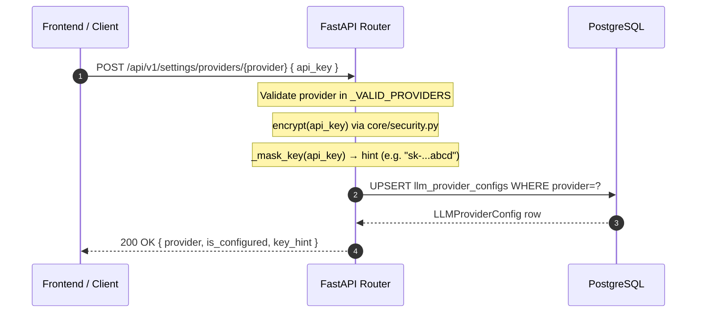

<Callout type="abstract">
Save or update an LLM provider's API key — validates the key is non-empty, encrypts it, stores it in `llm_provider_configs`, and caches the masked hint for display.
</Callout>


## 🔒 Authentication

| Property | Value |
| :--- | :--- |
| **Mechanism** | None |
| **Required** | No |


## 🛠️ Technical Specification

### Request

| Parameter | Location | Type | Required | Description |
| :--- | :--- | :--- | :--- | :--- |
| `provider` | Path | `string` | Yes | One of: `openai`, `gemini`, `anthropic`, `openrouter`, `ollama` |
| `api_key` | Body | `string` | Yes | Full API key to store |

**Pydantic Schema:** `backend/api/routes/settings.py :: SaveProviderRequest`


### Logic Flow




### 📦 Request Body

```json
{
  "api_key": "sk-ant-api03-..."
}
```


### 📤 Responses

| Status | When | Body |
| :--- | :--- | :--- |
| `200 OK` | Key saved | `ProviderStatus` |
| `400 Bad Request` | Invalid provider name | `{ "detail": "Invalid provider: xyz" }` |
| `422 Unprocessable Entity` | Empty api_key | `{ "detail": [...] }` |

**200 OK example:**
```json
{
  "provider": "anthropic",
  "is_configured": true,
  "is_active": true,
  "key_hint": "sk-...cdef"
}
```

**Pydantic Schema:** `backend/api/routes/settings.py :: ProviderStatus`


### 🗂️ Related Files

| Role | Path |
| :--- | :--- |
| Router | `backend/api/routes/settings.py` |
| Security | `backend/core/security.py :: encrypt(), _mask_key()` |
| DB Table | [DB - llm_provider_configs](/en/docs/llmsystemtrading/database/db-llm-provider-configs) |


## Related Endpoints (Settings Group)

| Method | Path | Purpose |
| :--- | :--- | :--- |
| `GET` | `/api/v1/settings/providers` | List all provider statuses (with hints, no keys) |
| `POST` | `/api/v1/settings/providers/{provider}/test` | Test provider connection |
| `POST` | `/api/v1/settings/task-assignments` | Save task→model mappings |
| `GET` | `/api/v1/settings/task-assignments` | Get current task assignments |
| `PUT` | `/api/v1/settings/global` | Update global settings (maintenance, pipeline toggles) |
| `GET` | `/api/v1/settings/global` | Get global settings |
| `PUT` | `/api/v1/settings/risk` | Update risk management rules |
| `PUT` | `/api/v1/settings/telegram` | Update Telegram bot config |


## 🗂️ Related

| Role | Link |
| :--- | :--- |
| Frontend Page | [Page - Settings](/en/docs/llmsystemtrading/frontend/pages/page-settings) |
| DB Schema | [DB - llm_provider_configs](/en/docs/llmsystemtrading/database/db-llm-provider-configs) |
| DB Schema | [DB - task_llm_assignments](/en/docs/llmsystemtrading/database/db-task-llm-assignments) |
| DB Schema | [DB - global_settings](/en/docs/llmsystemtrading/database/db-global-settings) |
