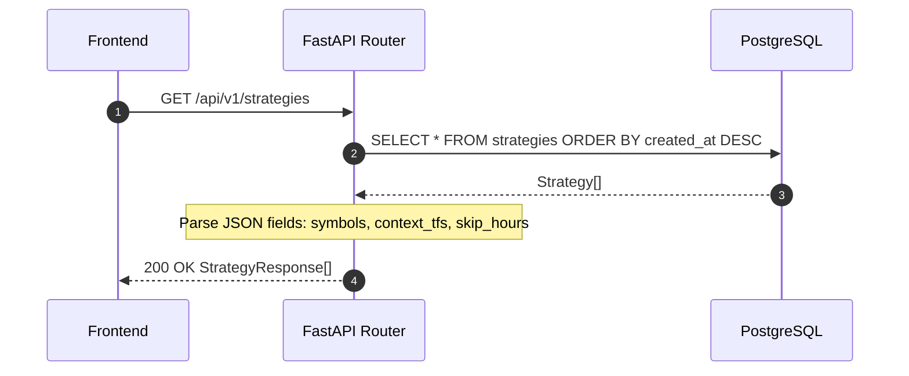

<Callout type="abstract">
Full CRUD for trading strategies plus account binding management, manual trigger, and performance stats — the core configuration layer that drives the automated trading scheduler.
</Callout>

## 🔒 Authentication

| Property | Value |
| :--- | :--- |
| **Mechanism** | None |
| **Required** | No |

## Endpoints in this group (13 total)

| Method | Path | Description |
| :--- | :--- | :--- |
| `GET` | `/api/v1/strategies` | List all strategies |
| `GET` | `/api/v1/strategies/registry` | List registered strategy class types |
| `POST` | `/api/v1/strategies` | Create new strategy |
| `GET` | `/api/v1/strategies/{id}` | Get strategy detail |
| `PATCH` | `/api/v1/strategies/{id}` | Update strategy fields |
| `DELETE` | `/api/v1/strategies/{id}` | Delete strategy (cascades to bindings + backtests) |
| `POST` | `/api/v1/strategies/{id}/trigger` | Manually fire analysis for this strategy now |
| `POST` | `/api/v1/strategies/{id}/activate-all` (or similar) | Activate/deactivate |
| `PATCH` | `/api/v1/strategies/{id}/bind/{account_id}` | Bind strategy to account |
| `DELETE` | `/api/v1/strategies/{id}/bind/{account_id}` | Unbind strategy from account |
| `GET` | `/api/v1/strategies/{id}/bindings` | List all account bindings |
| `GET` | `/api/v1/strategies/{id}/runs` | List recent pipeline runs |
| `GET` | `/api/v1/strategies/{id}/stats` | Performance statistics |

---

## GET /api/v1/strategies

> Returns all strategies with type, execution mode, symbols, and active status.

### Logic Flow



**200 OK example:**
```json
[
  {
    "id": 3,
    "name": "Harmonic EURUSD",
    "strategy_type": "code",
    "execution_mode": "multi_agent",
    "primary_tf": "H1",
    "symbols": ["EURUSD"],
    "is_active": true,
    "maintenance_enabled": true,
    "llm_provider": "anthropic",
    "llm_model": "claude-opus-4-7"
  }
]
```

**Pydantic Schema:** `backend/api/routes/strategies.py :: StrategyResponse`

---

## POST /api/v1/strategies

> Create a new strategy. The scheduler immediately registers cron/interval jobs for all bound accounts.

**Request body:** `StrategyCreate` schema — all fields documented in [DB - strategies](/en/docs/llmsystemtrading/database/db-strategies).

**Status:** `201 Created`

---

## POST /api/v1/strategies/{id}/trigger

> Manually fire the strategy's analysis pipeline right now (background task, returns 202 immediately).

**Logic:**
```
→ Resolve bound accounts
→ For each account: run LLM analysis pipeline
→ Return 202 Accepted immediately
→ Results appear in /api/v1/pipeline/runs
```

---

## PATCH /api/v1/strategies/{id}/bind/{account_id}

> Creates or updates an `account_strategy` binding. Scheduler adds cron job for this combination.

**Triggers:** `add_binding_jobs(strategy_id, account_id)` in `services/scheduler.py`

---

## DELETE /api/v1/strategies/{id}/bind/{account_id}

> Removes binding + removes cron job for this combination.

**Triggers:** `remove_binding_jobs(strategy_id, account_id)` in `services/scheduler.py`

---

## GET /api/v1/strategies/{id}/stats

> Performance metrics for this strategy: win rate, total P&L, trade count.

**Source:** Aggregates from `trades` table where `strategy_id = ?`

---

### 🗂️ Related Files

| Role | Path |
| :--- | :--- |
| Router | `backend/api/routes/strategies.py` |
| Scheduler | `backend/services/scheduler.py :: add_binding_jobs(), remove_binding_jobs()` |
| DB Table | [DB - strategies](/en/docs/llmsystemtrading/database/db-strategies) |
| DB Table | [DB - account_strategy](/en/docs/llmsystemtrading/database/db-account-strategy) |

## 🗂️ Related

| Role | Link |
| :--- | :--- |
| Frontend Page | [Page - Strategies](/en/docs/llmsystemtrading/frontend/pages/page-strategies) |
| DB Schema | [DB - strategies](/en/docs/llmsystemtrading/database/db-strategies) |
| DB Schema | [DB - account_strategy](/en/docs/llmsystemtrading/database/db-account-strategy) |
| Related Endpoint | [API-GET-v1-Scheduler](/en/docs/llmsystemtrading/api/scheduler/api-get-v1-scheduler) |
