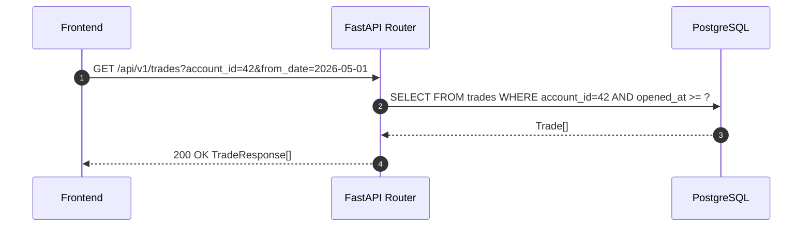

<Callout type="abstract">
List, view, update, and LLM-analyze individual trades for a given account — the primary data source for the Trades page and post-trade review workflow.
</Callout>

## 🔒 Authentication

| Property | Value |
| :--- | :--- |
| **Mechanism** | None |
| **Required** | No |

## Endpoints in this group

| Method | Path | Description |
| :--- | :--- | :--- |
| `GET` | `/api/v1/trades` | List trades with filters |
| `GET` | `/api/v1/trades/{trade_id}` | Get single trade detail |
| `PATCH` | `/api/v1/trades/{trade_id}` | Update trade fields |
| `POST` | `/api/v1/trades/{trade_id}/analyze` | Trigger LLM post-trade analysis |

---

## GET /api/v1/trades

> List trades for the active account with optional date range, symbol, and status filters.

### Request

| Parameter | Location | Type | Required | Description |
| :--- | :--- | :--- | :--- | :--- |
| `account_id` | Query | `integer` | Yes | Filter by account |
| `symbol` | Query | `string` | No | Filter by symbol (e.g., `EURUSD`) |
| `from_date` | Query | `string` | No | ISO date start (e.g., `2026-05-01`) |
| `to_date` | Query | `string` | No | ISO date end |
| `is_open` | Query | `boolean` | No | `true` = open trades only |
| `include_paper` | Query | `boolean` | No | Include paper trades (default: `false`) |
| `limit` | Query | `integer` | No | Max results (default: 100) |
| `offset` | Query | `integer` | No | Pagination offset |

### Logic Flow



### 📤 Responses

**200 OK example:**
```json
[
  {
    "id": 1001,
    "account_id": 42,
    "ticket": 55551234,
    "symbol": "EURUSD",
    "direction": "BUY",
    "volume": 0.1,
    "entry_price": 1.08520,
    "stop_loss": 1.08220,
    "take_profit": 1.09120,
    "close_price": 1.08980,
    "profit": 46.00,
    "opened_at": "2026-05-16T10:30:00Z",
    "closed_at": "2026-05-16T14:15:00Z",
    "source": "HarmonicStrategy",
    "order_status": "filled",
    "order_type": "market",
    "is_paper_trade": false,
    "strategy_id": 3,
    "trade_analysis": null
  }
]
```

**Pydantic Schema:** `backend/api/routes/trades.py :: TradeResponse`

---

## GET /api/v1/trades/{trade_id}

> Fetch a single trade by ID including its post-trade analysis if available.

---

## PATCH /api/v1/trades/{trade_id}

> Update editable trade fields (e.g., `maintenance_enabled`, `exclude_from_research`).

**Request body example:**
```json
{
  "maintenance_enabled": false,
  "exclude_from_research": true
}
```

---

## POST /api/v1/trades/{trade_id}/analyze

> Trigger an LLM post-trade analysis for a closed trade. Stores result in `trade_analysis` JSON column.

**Logic**: Fetches trade + journal + indicators → sends to LLM → updates `trades.trade_analysis` with JSON result.

**Response:** `{ "analysis": { "verdict": "...", "lessons": [...], "rating": 7 } }`

---

### 🗂️ Related Files

| Role | Path |
| :--- | :--- |
| Router | `backend/api/routes/trades.py` |
| DB Table | [DB - trades](/en/docs/llmsystemtrading/database/db-trades) |

## 🗂️ Related

| Role | Link |
| :--- | :--- |
| Frontend Page | [Page - Trades](/en/docs/llmsystemtrading/frontend/pages/page-trades) |
| DB Schema | [DB - trades](/en/docs/llmsystemtrading/database/db-trades) |
| DB Schema | [DB - ai_journal](/en/docs/llmsystemtrading/database/db-ai-journal) |
