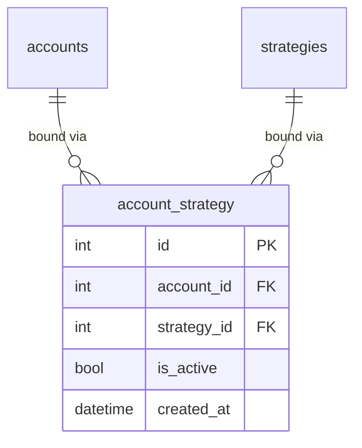

<Callout type="abstract">
Junction table binding MT5 accounts to trading strategies — controls which strategies are active on which accounts, with support for enabling/disabling individual bindings.
</Callout>

## Table Info

| Property | Value |
| :--- | :--- |
| **Table Name** | `account_strategy` |
| **SQLAlchemy Model** | `backend/db/models.py :: AccountStrategy` |
| **Pydantic Schema** | `backend/api/routes/strategies.py` |
| **Migration File** | `alembic/versions/` |
| **TimescaleDB Hypertable** | No |
| **Partition Column** | — |


## Columns

| Column | SQLAlchemy Type | Nullable | Default | Description |
| :--- | :--- | :--- | :--- | :--- |
| `id` | `Integer` | No | auto | Primary key |
| `account_id` | `Integer` FK | No | — | FK → `accounts.id` |
| `strategy_id` | `Integer` FK | No | — | FK → `strategies.id` |
| `is_active` | `Boolean` | No | `True` | Whether this binding is currently live |
| `created_at` | `DateTime(timezone=True)` | No | `datetime.now(UTC)` | Binding creation timestamp |


## Constraints & Indexes

| Name | Type | Columns | Purpose |
| :--- | :--- | :--- | :--- |
| `pk_account_strategy` | PRIMARY KEY | `id` | Row uniqueness |
| `uq_account_strategy` | UNIQUE | `(account_id, strategy_id)` | No duplicate bindings |
| `fk_account` | FOREIGN KEY | `account_id → accounts.id` | Referential integrity |
| `fk_strategy` | FOREIGN KEY | `strategy_id → strategies.id` | Referential integrity |


## Entity Relationships




## SQLAlchemy Model (reference snapshot)

```python
class AccountStrategy(Base):
    __tablename__ = "account_strategy"

    id: Mapped[int] = mapped_column(Integer, primary_key=True)
    account_id: Mapped[int] = mapped_column(ForeignKey("accounts.id"))
    strategy_id: Mapped[int] = mapped_column(ForeignKey("strategies.id"))
    is_active: Mapped[bool] = mapped_column(Boolean, default=True)
    created_at: Mapped[datetime] = mapped_column(DateTime(timezone=True), default=lambda: datetime.now(UTC))

    __table_args__ = (UniqueConstraint("account_id", "strategy_id", name="uq_account_strategy"),)

    account: Mapped["Account"] = relationship("Account", back_populates="strategy_bindings")
    strategy: Mapped["Strategy"] = relationship("Strategy", back_populates="account_bindings")
```


## Service Layer

| Layer | File | Purpose |
| :--- | :--- | :--- |
| Router | `backend/api/routes/strategies.py` | Binding CRUD |
| Scheduler | `backend/services/scheduler.py` | `add_binding_jobs()` / `remove_binding_jobs()` reads active bindings |


## 🗂️ Related

| Role | Link |
| :--- | :--- |
| API Endpoint | [API-POST-v1-Strategies](API-POST-v1-Strategies) |
| Related Table | [DB - accounts](/en/docs/llmsystemtrading/database/db-accounts) |
| Related Table | [DB - strategies](/en/docs/llmsystemtrading/database/db-strategies) |
