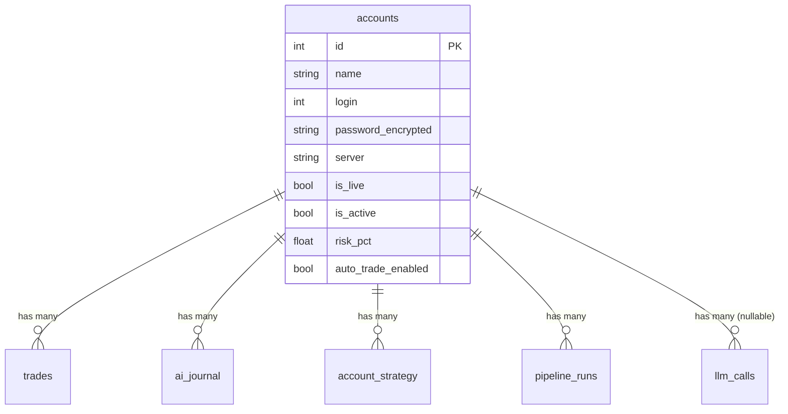

<Callout type="abstract">
Stores MT5 trading account credentials, configuration, and trading limits — one row per registered account.
</Callout>

## Table Info

| Property | Value |
| :--- | :--- |
| **Table Name** | `accounts` |
| **SQLAlchemy Model** | `backend/db/models.py :: Account` |
| **Pydantic Schema** | `backend/api/routes/accounts.py :: AccountCreate / AccountResponse` |
| **Migration File** | `alembic/versions/` |
| **TimescaleDB Hypertable** | No |
| **Partition Column** | — |


## Columns

| Column | SQLAlchemy Type | Nullable | Default | Description |
| :--- | :--- | :--- | :--- | :--- |
| `id` | `Integer` | No | auto | Primary key |
| `name` | `String(100)` | No | — | Human-readable account label |
| `broker` | `String(100)` | No | — | Broker name (e.g., "MetaQuotes") |
| `login` | `Integer` | No | — | MT5 account number (unique + indexed) |
| `password_encrypted` | `String(500)` | No | — | Fernet-encrypted MT5 password |
| `server` | `String(200)` | No | — | MT5 server string (e.g., "MetaQuotes-Demo") |
| `is_live` | `Boolean` | No | `False` | True = live account; False = demo |
| `is_active` | `Boolean` | No | `True` | Soft-delete flag |
| `created_at` | `DateTime(timezone=True)` | No | `datetime.now(UTC)` | Registration timestamp |
| `allowed_symbols` | `Text` | No | `""` | JSON list of permitted symbols |
| `max_lot_size` | `Float` | No | `0.1` | Maximum volume per trade in lots |
| `risk_pct` | `Float` | No | `0.01` | Fraction of balance to risk per trade (0.01 = 1%) |
| `auto_trade_enabled` | `Boolean` | No | `True` | Allow automated LLM-driven trading |
| `paper_trade_enabled` | `Boolean` | No | `False` | If True, execute paper trades instead of live |
| `mt5_path` | `String(500)` | No | `""` | Path to terminal64.exe (overrides global MT5_PATH) |
| `account_type` | `String(20)` | No | `"USD"` | Account denomination: `USD` or `USC` |


## Constraints & Indexes

| Name | Type | Columns | Purpose |
| :--- | :--- | :--- | :--- |
| `pk_accounts` | PRIMARY KEY | `id` | Row uniqueness |
| `uq_accounts_login` | UNIQUE | `login` | No duplicate MT5 account numbers |
| `idx_accounts_login` | INDEX | `login` | Fast lookup by MT5 login number |


## Entity Relationships




## SQLAlchemy Model (reference snapshot)

```python
class Account(Base):
    __tablename__ = "accounts"

    id: Mapped[int] = mapped_column(Integer, primary_key=True)
    name: Mapped[str] = mapped_column(String(100))
    broker: Mapped[str] = mapped_column(String(100))
    login: Mapped[int] = mapped_column(Integer, unique=True, index=True)
    password_encrypted: Mapped[str] = mapped_column(String(500))  # Fernet-encrypted
    server: Mapped[str] = mapped_column(String(200))
    is_live: Mapped[bool] = mapped_column(Boolean, default=False)
    is_active: Mapped[bool] = mapped_column(Boolean, default=True)
    created_at: Mapped[datetime] = mapped_column(DateTime(timezone=True), default=lambda: datetime.now(UTC))
    allowed_symbols: Mapped[str] = mapped_column(Text, default="")  # JSON list
    max_lot_size: Mapped[float] = mapped_column(Float, default=0.1)
    risk_pct: Mapped[float] = mapped_column(Float, default=0.01)
    auto_trade_enabled: Mapped[bool] = mapped_column(Boolean, default=True)
    paper_trade_enabled: Mapped[bool] = mapped_column(Boolean, default=False)
    mt5_path: Mapped[str] = mapped_column(String(500), default="")
    account_type: Mapped[str] = mapped_column(String(20), default="USD")

    trades: Mapped[list["Trade"]] = relationship("Trade", back_populates="account")
    journal_entries: Mapped[list["AIJournal"]] = relationship("AIJournal", back_populates="account")
    strategy_bindings: Mapped[list["AccountStrategy"]] = relationship(
        "AccountStrategy", back_populates="account", cascade="all, delete-orphan"
    )
```


## Service Layer

| Layer | File | Purpose |
| :--- | :--- | :--- |
| Router | `backend/api/routes/accounts.py` | CRUD endpoints |
| MT5 Bridge | `backend/mt5/bridge.py` | Connect/fetch live data |
| Security | `backend/core/security.py` | encrypt() / decrypt() for password |


## 🗂️ Related

| Role | Link |
| :--- | :--- |
| API Endpoint | [API-POST-v1-Accounts](/en/docs/llmsystemtrading/api/accounts/api-post-v1-accounts) |
| API Endpoint | [API-GET-v1-Accounts](/en/docs/llmsystemtrading/api/accounts/api-get-v1-accounts) |
| Frontend Page | [Page - Accounts](/en/docs/llmsystemtrading/frontend/pages/page-accounts) |
| Related Table | [DB - trades](/en/docs/llmsystemtrading/database/db-trades) |
| Related Table | [DB - account_strategy](/en/docs/llmsystemtrading/database/db-account-strategy) |
