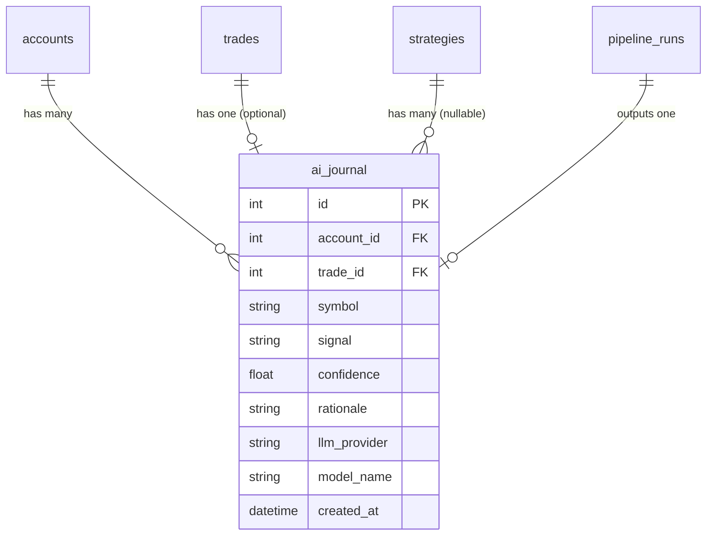

<Callout type="abstract">
Stores every LLM trading signal decision — the signal type, confidence score, rationale, and indicator snapshot — as an auditable record of AI reasoning before execution.
</Callout>

## Table Info

| Property | Value |
| :--- | :--- |
| **Table Name** | `ai_journal` |
| **SQLAlchemy Model** | `backend/db/models.py :: AIJournal` |
| **Pydantic Schema** | `backend/api/routes/accounts.py` (referenced via response) |
| **Migration File** | `alembic/versions/` |
| **TimescaleDB Hypertable** | No |
| **Partition Column** | — |


## Columns

| Column | SQLAlchemy Type | Nullable | Default | Description |
| :--- | :--- | :--- | :--- | :--- |
| `id` | `Integer` | No | auto | Primary key |
| `account_id` | `Integer` FK | No | — | FK → `accounts.id` (indexed) |
| `trade_id` | `Integer` FK | Yes | `null` | FK → `trades.id` (UNIQUE — 1:1 optional link) |
| `symbol` | `String(20)` | No | — | Trading pair (indexed) |
| `timeframe` | `String(10)` | No | — | Analysis timeframe (e.g., `M15`, `H1`) |
| `signal` | `String(15)` | No | — | `BUY` \| `SELL` \| `BUY_LIMIT` \| `SELL_LIMIT` \| `HOLD` |
| `confidence` | `Float` | No | — | LLM confidence score (0.0–1.0) |
| `rationale` | `Text` | No | — | Full LLM explanation text |
| `indicators_snapshot` | `Text` | No | — | JSON snapshot of indicator values at decision time |
| `llm_provider` | `String(50)` | No | — | Provider used: `anthropic`, `openai`, `gemini`, etc. |
| `model_name` | `String(100)` | No | `""` | Model ID used (e.g., `claude-opus-4-7`) |
| `created_at` | `DateTime(timezone=True)` | No | `datetime.now(UTC)` | Decision timestamp |
| `strategy_id` | `Integer` FK | Yes | `null` | FK → `strategies.id` (SET NULL on delete) |


## Constraints & Indexes

| Name | Type | Columns | Purpose |
| :--- | :--- | :--- | :--- |
| `pk_ai_journal` | PRIMARY KEY | `id` | Row uniqueness |
| `uq_ai_journal_trade_id` | UNIQUE | `trade_id` | Enforce 1:1 with trades |
| `idx_ai_journal_account_id` | INDEX | `account_id` | Filter by account |
| `idx_ai_journal_symbol` | INDEX | `symbol` | Filter by symbol |
| `fk_ai_journal_account` | FOREIGN KEY | `account_id → accounts.id` | Referential integrity |
| `fk_ai_journal_trade` | FOREIGN KEY | `trade_id → trades.id` | Optional link to executed trade |
| `fk_ai_journal_strategy` | FOREIGN KEY | `strategy_id → strategies.id` | SET NULL on strategy delete |


## Entity Relationships




## SQLAlchemy Model (reference snapshot)

```python
class AIJournal(Base):
    __tablename__ = "ai_journal"

    id: Mapped[int] = mapped_column(Integer, primary_key=True)
    account_id: Mapped[int] = mapped_column(Integer, ForeignKey("accounts.id"), index=True)
    trade_id: Mapped[int | None] = mapped_column(Integer, ForeignKey("trades.id"), unique=True, nullable=True)
    symbol: Mapped[str] = mapped_column(String(20), index=True)
    timeframe: Mapped[str] = mapped_column(String(10))
    signal: Mapped[str] = mapped_column(String(15))       # BUY | SELL | BUY_LIMIT | SELL_LIMIT | HOLD
    confidence: Mapped[float] = mapped_column(Float)
    rationale: Mapped[str] = mapped_column(Text)
    indicators_snapshot: Mapped[str] = mapped_column(Text)  # JSON string
    llm_provider: Mapped[str] = mapped_column(String(50))
    model_name: Mapped[str] = mapped_column(String(100), default="")
    created_at: Mapped[datetime] = mapped_column(DateTime(timezone=True), default=lambda: datetime.now(UTC))
    strategy_id: Mapped[int | None] = mapped_column(
        Integer, ForeignKey("strategies.id", ondelete="SET NULL"), nullable=True
    )

    account: Mapped["Account"] = relationship("Account", back_populates="journal_entries")
    trade: Mapped["Trade | None"] = relationship("Trade", back_populates="journal", uselist=False)
    strategy: Mapped["Strategy | None"] = relationship("Strategy", back_populates="journal_entries_strategy")
```


## Service Layer

| Layer | File | Purpose |
| :--- | :--- | :--- |
| AI Pipeline | `backend/ai/vision.py` | Creates journal entries from LLM responses |
| Router | `backend/api/routes/accounts.py` | Research cycle reads journal to count decisions |
| Router | `backend/api/routes/analytics.py` | Queries journal for LLM performance metrics |


## 🗂️ Related

| Role | Link |
| :--- | :--- |
| API Endpoint | [API-GET-v1-Analytics](/en/docs/llmsystemtrading/api/analytics/api-get-v1-analytics) |
| Frontend Page | [Page - Analytics](/en/docs/llmsystemtrading/frontend/pages/page-analytics) |
| Related Table | [DB - trades](/en/docs/llmsystemtrading/database/db-trades) |
| Related Table | [DB - accounts](/en/docs/llmsystemtrading/database/db-accounts) |
| Related Table | [DB - pipeline_runs](/en/docs/llmsystemtrading/database/db-pipeline-runs) |
