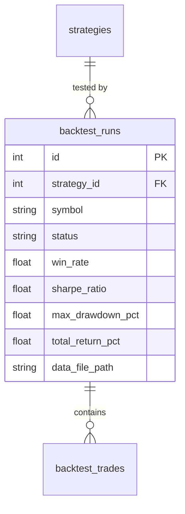

<Callout type="abstract">
Stores one backtest execution per row — configuration, status, progress, all performance metrics (win rate, Sharpe, drawdown), and a link to its generated OHLCV data file.
</Callout>

## Table Info

| Property | Value |
| :--- | :--- |
| **Table Name** | `backtest_runs` |
| **SQLAlchemy Model** | `backend/db/models.py :: BacktestRun` |
| **Pydantic Schema** | `backend/api/routes/backtest.py` |
| **Migration File** | `alembic/versions/` |
| **TimescaleDB Hypertable** | No |
| **Partition Column** | — |


## Columns

| Column | SQLAlchemy Type | Nullable | Default | Description |
| :--- | :--- | :--- | :--- | :--- |
| `id` | `Integer` | No | auto | Primary key |
| `strategy_id` | `Integer` FK | No | — | FK → `strategies.id` (CASCADE delete, indexed) |
| `symbol` | `String(20)` | No | — | Symbol tested (indexed) |
| `timeframe` | `String(10)` | No | — | Primary timeframe (e.g., `M15`) |
| `start_date` | `DateTime(timezone=True)` | No | — | Backtest start date |
| `end_date` | `DateTime(timezone=True)` | No | — | Backtest end date |
| `initial_balance` | `Float` | No | `10000.0` | Starting capital in account currency |
| `spread_pips` | `Float` | No | `1.5` | Simulated spread in pips |
| `execution_mode` | `String(20)` | No | `"close_price"` | `close_price` — execution at candle close |
| `primary_tf` | `String(10)` | No | `"M15"` | Primary candle timeframe |
| `context_tfs` | `Text` | No | `"[]"` | JSON list of context timeframes |
| `max_llm_calls` | `Integer` | No | `100` | LLM call budget for this run |
| `status` | `String(20)` | No | `"pending"` | `pending` \| `running` \| `completed` \| `failed` \| `cancelled` |
| `progress_pct` | `Integer` | No | `0` | Progress 0–100 |
| `error_message` | `Text` | Yes | `null` | Error if status=failed |
| `total_trades` | `Integer` | Yes | `null` | Total trades executed in backtest |
| `win_rate` | `Float` | Yes | `null` | Win rate 0.0–1.0 |
| `profit_factor` | `Float` | Yes | `null` | Gross profit / gross loss |
| `expectancy` | `Float` | Yes | `null` | Expected P&L per trade |
| `max_drawdown_pct` | `Float` | Yes | `null` | Max drawdown as % of peak equity |
| `recovery_factor` | `Float` | Yes | `null` | Net profit / max drawdown |
| `sharpe_ratio` | `Float` | Yes | `null` | Risk-adjusted return (annualized) |
| `sortino_ratio` | `Float` | Yes | `null` | Downside risk-adjusted return |
| `total_return_pct` | `Float` | Yes | `null` | Total return % |
| `avg_win` | `Float` | Yes | `null` | Average winning trade P&L |
| `avg_loss` | `Float` | Yes | `null` | Average losing trade P&L |
| `max_consec_wins` | `Integer` | Yes | `null` | Maximum consecutive wins |
| `max_consec_losses` | `Integer` | Yes | `null` | Maximum consecutive losses |
| `avg_spread` | `Float` | Yes | `null` | Average spread over test period |
| `commission_per_lot` | `Float` | No | `0.0` | Commission cost per lot |
| `tp_partial_close_ratio` | `Float` | No | `0.5` | Partial close ratio at TP |
| `data_file_path` | `Text` | Yes | `null` | Path to OHLCV CSV for chart replay |
| `created_at` | `DateTime(timezone=True)` | No | `datetime.now(UTC)` | Run creation timestamp (indexed) |


## Constraints & Indexes

| Name | Type | Columns | Purpose |
| :--- | :--- | :--- | :--- |
| `pk_backtest_runs` | PRIMARY KEY | `id` | Row uniqueness |
| `idx_backtest_strategy` | INDEX | `strategy_id` | Filter by strategy |
| `idx_backtest_symbol` | INDEX | `symbol` | Filter by symbol |
| `idx_backtest_created` | INDEX | `created_at` | Sort by recency |
| `fk_backtest_strategy` | FOREIGN KEY | `strategy_id → strategies.id CASCADE` | Delete runs when strategy deleted |


## Entity Relationships




## SQLAlchemy Model (reference snapshot)

```python
class BacktestRun(Base):
    __tablename__ = "backtest_runs"

    id: Mapped[int] = mapped_column(Integer, primary_key=True)
    strategy_id: Mapped[int] = mapped_column(Integer, ForeignKey("strategies.id", ondelete="CASCADE"), index=True)
    symbol: Mapped[str] = mapped_column(String(20), index=True)
    timeframe: Mapped[str] = mapped_column(String(10))
    start_date: Mapped[datetime] = mapped_column(DateTime(timezone=True))
    end_date: Mapped[datetime] = mapped_column(DateTime(timezone=True))
    initial_balance: Mapped[float] = mapped_column(Float, default=10000.0)
    spread_pips: Mapped[float] = mapped_column(Float, default=1.5)
    execution_mode: Mapped[str] = mapped_column(String(20), default="close_price")
    primary_tf: Mapped[str] = mapped_column(String(10), default="M15")
    context_tfs: Mapped[str] = mapped_column(Text, default="[]")
    max_llm_calls: Mapped[int] = mapped_column(Integer, default=100)
    status: Mapped[str] = mapped_column(String(20), default="pending")
    progress_pct: Mapped[int] = mapped_column(Integer, default=0)
    error_message: Mapped[str | None] = mapped_column(Text, nullable=True)
    total_trades: Mapped[int | None] = mapped_column(Integer, nullable=True)
    win_rate: Mapped[float | None] = mapped_column(Float, nullable=True)
    sharpe_ratio: Mapped[float | None] = mapped_column(Float, nullable=True)
    # ... (all metric columns)
    data_file_path: Mapped[str | None] = mapped_column(Text, nullable=True)
    created_at: Mapped[datetime] = mapped_column(DateTime(timezone=True), default=lambda: datetime.now(UTC), index=True)
    trades: Mapped[list["BacktestTrade"]] = relationship("BacktestTrade", back_populates="run", cascade="all, delete-orphan")
```


## 🗂️ Related

| Role | Link |
| :--- | :--- |
| API Endpoint | [API-POST-v1-Backtest](API-POST-v1-Backtest) |
| Frontend Page | [Page - Backtest](/en/docs/llmsystemtrading/frontend/pages/page-backtest) |
| Related Table | [DB - strategies](/en/docs/llmsystemtrading/database/db-strategies) |
| Related Table | [DB - backtest_trades](DB - backtest_trades) |
| Related Table | [DB - optimization_runs](/en/docs/llmsystemtrading/database/db-optimization-runs) |
