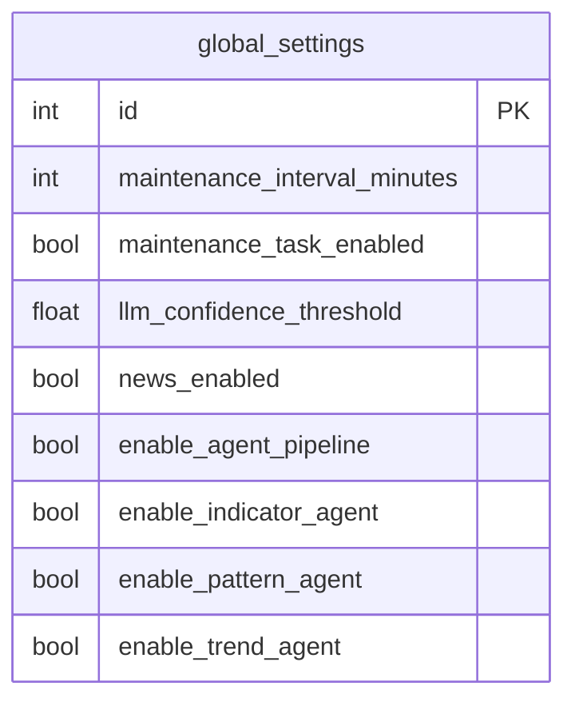

<Callout type="abstract">
Singleton configuration table (always one row with id=1) storing system-wide toggles — maintenance interval, confidence threshold, news filter, and agent pipeline flags.
</Callout>

## Table Info

| Property | Value |
| :--- | :--- |
| **Table Name** | `global_settings` |
| **SQLAlchemy Model** | `backend/db/models.py :: GlobalSettings` |
| **Pydantic Schema** | `backend/api/routes/settings.py :: GlobalSettingsModel` |
| **Migration File** | `alembic/versions/` |
| **TimescaleDB Hypertable** | No |
| **Partition Column** | — |


## Columns

| Column | SQLAlchemy Type | Nullable | Default | Description |
| :--- | :--- | :--- | :--- | :--- |
| `id` | `Integer` | No | `1` | Primary key (always 1 — singleton row) |
| `maintenance_interval_minutes` | `Integer` | No | `60` | How often the maintenance agent runs (minutes) |
| `maintenance_task_enabled` | `Boolean` | No | `True` | Enable/disable maintenance agent globally |
| `llm_confidence_threshold` | `Float` | No | `0.70` | Minimum confidence score to execute a trade |
| `news_enabled` | `Boolean` | No | `False` | Enable news filter (skip trading during high-impact news) |
| `enable_agent_pipeline` | `Boolean` | No | `False` | Enable multi-agent pipeline instead of single LLM call |
| `enable_indicator_agent` | `Boolean` | No | `True` | Enable indicator analysis agent |
| `enable_pattern_agent` | `Boolean` | No | `True` | Enable pattern recognition agent |
| `enable_trend_agent` | `Boolean` | No | `True` | Enable trend analysis agent |
| `updated_at` | `DateTime(timezone=True)` | No | `datetime.now(UTC)` | Last update timestamp |


## Constraints & Indexes

| Name | Type | Columns | Purpose |
| :--- | :--- | :--- | :--- |
| `pk_global_settings` | PRIMARY KEY | `id` | Singleton enforcement (only id=1 exists) |


## Entity Relationships




## SQLAlchemy Model (reference snapshot)

```python
class GlobalSettings(Base):
    __tablename__ = "global_settings"

    id: Mapped[int] = mapped_column(Integer, primary_key=True)
    maintenance_interval_minutes: Mapped[int] = mapped_column(Integer, default=60)
    maintenance_task_enabled: Mapped[bool] = mapped_column(Boolean, default=True)
    llm_confidence_threshold: Mapped[float] = mapped_column(Float, default=0.70)
    news_enabled: Mapped[bool] = mapped_column(Boolean, default=False)
    enable_agent_pipeline: Mapped[bool] = mapped_column(Boolean, default=False)
    enable_indicator_agent: Mapped[bool] = mapped_column(Boolean, default=True)
    enable_pattern_agent: Mapped[bool] = mapped_column(Boolean, default=True)
    enable_trend_agent: Mapped[bool] = mapped_column(Boolean, default=True)
    updated_at: Mapped[datetime] = mapped_column(
        DateTime(timezone=True),
        default=lambda: datetime.now(UTC),
        onupdate=lambda: datetime.now(UTC),
    )
```


## Service Layer

| Layer | File | Purpose |
| :--- | :--- | :--- |
| Router | `backend/api/routes/settings.py` | GET/PUT settings |
| Startup | `backend/main.py` (lifespan) | Loads row into `core.config.settings` object on startup |
| AI Pipeline | `backend/ai/` | Reads `settings.llm_confidence_threshold` before execution |


## 🗂️ Related

| Role | Link |
| :--- | :--- |
| API Endpoint | [API-POST-v1-Settings](/en/docs/llmsystemtrading/api/settings/api-post-v1-settings) |
| Frontend Page | [Page - Settings](/en/docs/llmsystemtrading/frontend/pages/page-settings) |
| Related Table | [DB - telegram_settings](/en/docs/llmsystemtrading/database/db-telegram-settings) |
| Related Table | [DB - llm_provider_configs](/en/docs/llmsystemtrading/database/db-llm-provider-configs) |
