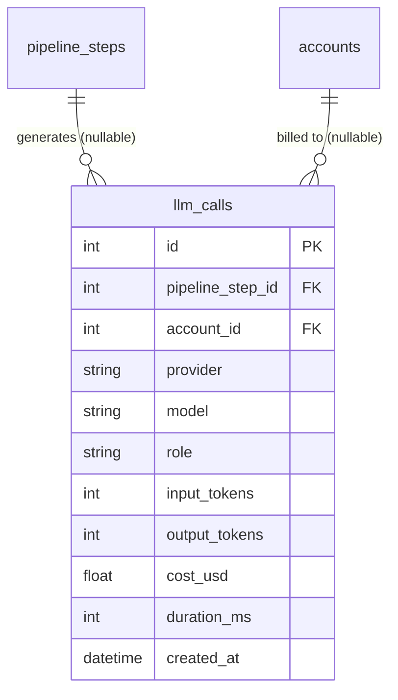

<Callout type="abstract">
Audit log of every LLM API call — provider, model, token counts, cost, and duration — enabling usage analytics and cost tracking per account and pipeline step.
</Callout>

## Table Info

| Property | Value |
| :--- | :--- |
| **Table Name** | `llm_calls` |
| **SQLAlchemy Model** | `backend/db/models.py :: LLMCall` |
| **Pydantic Schema** | `backend/api/routes/llm_usage.py` |
| **Migration File** | `alembic/versions/` |
| **TimescaleDB Hypertable** | No |
| **Partition Column** | — |


## Columns

| Column | SQLAlchemy Type | Nullable | Default | Description |
| :--- | :--- | :--- | :--- | :--- |
| `id` | `Integer` | No | auto | Primary key |
| `pipeline_step_id` | `Integer` FK | Yes | `null` | FK → `pipeline_steps.id` (SET NULL on delete, indexed) |
| `account_id` | `Integer` FK | Yes | `null` | FK → `accounts.id` (SET NULL on delete) |
| `provider` | `String(50)` | No | — | LLM provider: `anthropic`, `openai`, `gemini`, etc. |
| `model` | `String(100)` | No | — | Model ID used (e.g., `claude-opus-4-7`) |
| `role` | `String(50)` | No | — | Caller role (e.g., `indicator_agent`, `vision`, `execution`) |
| `input_tokens` | `Integer` | Yes | `null` | Prompt token count |
| `output_tokens` | `Integer` | Yes | `null` | Completion token count |
| `total_tokens` | `Integer` | Yes | `null` | Total tokens (input + output) |
| `cost_usd` | `Float` | Yes | `null` | Estimated cost in USD |
| `duration_ms` | `Integer` | No | `0` | LLM API call wall-clock time |
| `created_at` | `DateTime(timezone=True)` | No | `datetime.now(UTC)` | Call timestamp |


## Constraints & Indexes

| Name | Type | Columns | Purpose |
| :--- | :--- | :--- | :--- |
| `pk_llm_calls` | PRIMARY KEY | `id` | Row uniqueness |
| `idx_llm_calls_step` | INDEX | `pipeline_step_id` | Join to pipeline step |
| `fk_llm_calls_step` | FOREIGN KEY | `pipeline_step_id → pipeline_steps.id SET NULL` | Preserve logs when step deleted |
| `fk_llm_calls_account` | FOREIGN KEY | `account_id → accounts.id SET NULL` | Preserve logs when account deleted |


## Entity Relationships




## SQLAlchemy Model (reference snapshot)

```python
class LLMCall(Base):
    __tablename__ = "llm_calls"

    id: Mapped[int] = mapped_column(Integer, primary_key=True)
    pipeline_step_id: Mapped[int | None] = mapped_column(
        Integer, ForeignKey("pipeline_steps.id", ondelete="SET NULL"), nullable=True, index=True
    )
    account_id: Mapped[int | None] = mapped_column(
        Integer, ForeignKey("accounts.id", ondelete="SET NULL"), nullable=True
    )
    provider: Mapped[str] = mapped_column(String(50), nullable=False)
    model: Mapped[str] = mapped_column(String(100), nullable=False)
    role: Mapped[str] = mapped_column(String(50), nullable=False)
    input_tokens: Mapped[int | None] = mapped_column(Integer, nullable=True)
    output_tokens: Mapped[int | None] = mapped_column(Integer, nullable=True)
    total_tokens: Mapped[int | None] = mapped_column(Integer, nullable=True)
    cost_usd: Mapped[float | None] = mapped_column(Float, nullable=True)
    duration_ms: Mapped[int] = mapped_column(Integer, default=0)
    created_at: Mapped[datetime] = mapped_column(DateTime(timezone=True), default=lambda: datetime.now(UTC))
```


## Service Layer

| Layer | File | Purpose |
| :--- | :--- | :--- |
| Router | `backend/api/routes/llm_usage.py` | Token usage summary + per-model breakdown |
| Router | `backend/api/routes/llm_analytics.py` | Cost analytics, model performance |


## 🗂️ Related

| Role | Link |
| :--- | :--- |
| API Endpoint | [API-GET-v1-LLM-Usage](API-GET-v1-LLM-Usage) |
| API Endpoint | [API-GET-v1-LLM-Analytics](API-GET-v1-LLM-Analytics) |
| Frontend Page | [Page - LLM Usage](/en/docs/llmsystemtrading/frontend/pages/page-llm-usage) |
| Related Table | [DB - pipeline_steps](/en/docs/llmsystemtrading/database/db-pipeline-steps) |
