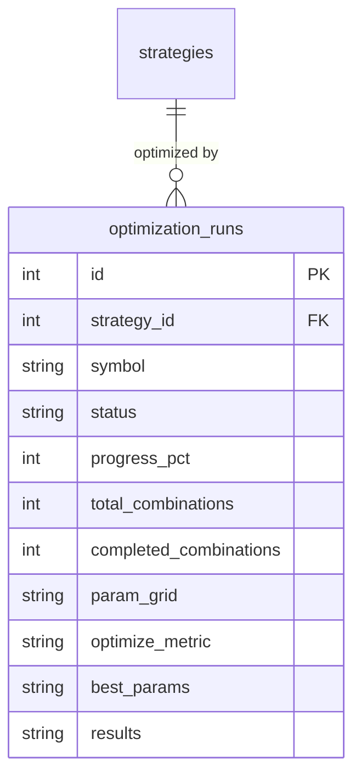

<Callout type="abstract">
Stores parameter sweep jobs — one row per optimization request — tracking the search space, progress, results ranking, and best parameter combination found.
</Callout>

## Table Info

| Property | Value |
| :--- | :--- |
| **Table Name** | `optimization_runs` |
| **SQLAlchemy Model** | `backend/db/models.py :: OptimizationRun` |
| **Pydantic Schema** | `backend/api/routes/backtest.py` |
| **Migration File** | `alembic/versions/` |
| **TimescaleDB Hypertable** | No |
| **Partition Column** | — |


## Columns

| Column | SQLAlchemy Type | Nullable | Default | Description |
| :--- | :--- | :--- | :--- | :--- |
| `id` | `Integer` | No | auto | Primary key |
| `strategy_id` | `Integer` FK | No | — | FK → `strategies.id` (CASCADE delete, indexed) |
| `symbol` | `String(20)` | No | — | Symbol to optimize on (indexed) |
| `timeframe` | `String(10)` | No | `"M15"` | Candle timeframe |
| `start_date` | `DateTime(timezone=True)` | No | — | Optimization date range start |
| `end_date` | `DateTime(timezone=True)` | No | — | Optimization date range end |
| `initial_balance` | `Float` | No | `10000.0` | Starting capital |
| `spread_pips` | `Float` | No | `1.5` | Simulated spread |
| `execution_mode` | `String(20)` | No | `"close_price"` | Execution timing |
| `volume` | `Float` | No | `0.1` | Trade volume in lots |
| `risk_pct` | `Float` | Yes | `null` | Risk per trade (null = fixed volume) |
| `commission_per_lot` | `Float` | No | `0.0` | Commission per lot |
| `tp_partial_close_ratio` | `Float` | No | `0.5` | Partial close ratio at TP |
| `max_workers` | `Integer` | No | `4` | Concurrent parameter combinations |
| `csv_upload_id` | `Text` | Yes | `null` | Primary timeframe CSV file path |
| `csv_uploads` | `Text` | Yes | `null` | JSON dict of `{timeframe: csv_path}` |
| `param_grid` | `Text` | No | `"{}"` | JSON dict of `{param_name: [v1, v2, ...]}` |
| `optimize_metric` | `String(50)` | No | `"sharpe_ratio"` | Metric to rank combinations by |
| `status` | `String(20)` | No | `"pending"` | `pending` \| `running` \| `completed` \| `failed` \| `cancelled` |
| `progress_pct` | `Integer` | No | `0` | Progress 0–100 |
| `total_combinations` | `Integer` | No | `0` | Total parameter combinations in grid |
| `completed_combinations` | `Integer` | No | `0` | Combinations tested so far |
| `started_at` | `DateTime(timezone=True)` | Yes | `null` | Execution start time |
| `completed_at` | `DateTime(timezone=True)` | Yes | `null` | Execution completion time |
| `error_message` | `Text` | Yes | `null` | Error if status=failed |
| `results` | `Text` | Yes | `null` | JSON ranked list of `{params, metrics}` |
| `best_params` | `Text` | Yes | `null` | JSON top-ranked parameter combination |
| `created_at` | `DateTime(timezone=True)` | No | `datetime.now(UTC)` | Request creation timestamp (indexed) |


## Constraints & Indexes

| Name | Type | Columns | Purpose |
| :--- | :--- | :--- | :--- |
| `pk_optimization_runs` | PRIMARY KEY | `id` | Row uniqueness |
| `idx_opt_strategy` | INDEX | `strategy_id` | Filter by strategy |
| `idx_opt_symbol` | INDEX | `symbol` | Filter by symbol |
| `idx_opt_created` | INDEX | `created_at` | Sort by recency |
| `fk_opt_strategy` | FOREIGN KEY | `strategy_id → strategies.id CASCADE` | Delete runs with strategy |


## Entity Relationships




## SQLAlchemy Model (reference snapshot)

```python
class OptimizationRun(Base):
    """Stores a parameter sweep job — one row per optimization request.

    param_grid  — JSON dict: {param_name: [v1, v2, ...]}  (the search space)
    results     — JSON list: [{params: {...}, metrics: {...}}, ...] ranked by optimize_metric
    best_params — JSON dict: the top-ranked param combination
    """
    __tablename__ = "optimization_runs"

    id: Mapped[int] = mapped_column(Integer, primary_key=True)
    strategy_id: Mapped[int] = mapped_column(Integer, ForeignKey("strategies.id", ondelete="CASCADE"), index=True)
    param_grid: Mapped[str] = mapped_column(Text, default="{}")
    optimize_metric: Mapped[str] = mapped_column(String(50), default="sharpe_ratio")
    status: Mapped[str] = mapped_column(String(20), default="pending")
    progress_pct: Mapped[int] = mapped_column(Integer, default=0)
    total_combinations: Mapped[int] = mapped_column(Integer, default=0)
    completed_combinations: Mapped[int] = mapped_column(Integer, default=0)
    results: Mapped[str | None] = mapped_column(Text, nullable=True)
    best_params: Mapped[str | None] = mapped_column(Text, nullable=True)
    created_at: Mapped[datetime] = mapped_column(DateTime(timezone=True), default=lambda: datetime.now(UTC), index=True)

    strategy: Mapped["Strategy"] = relationship("Strategy")
```


## 🗂️ Related

| Role | Link |
| :--- | :--- |
| API Endpoint | [API-POST-v1-Backtest-Optimize](API-POST-v1-Backtest-Optimize) |
| Frontend Page | [Page - Backtest](/en/docs/llmsystemtrading/frontend/pages/page-backtest) |
| Related Table | [DB - strategies](/en/docs/llmsystemtrading/database/db-strategies) |
| Related Table | [DB - backtest_runs](/en/docs/llmsystemtrading/database/db-backtest-runs) |
