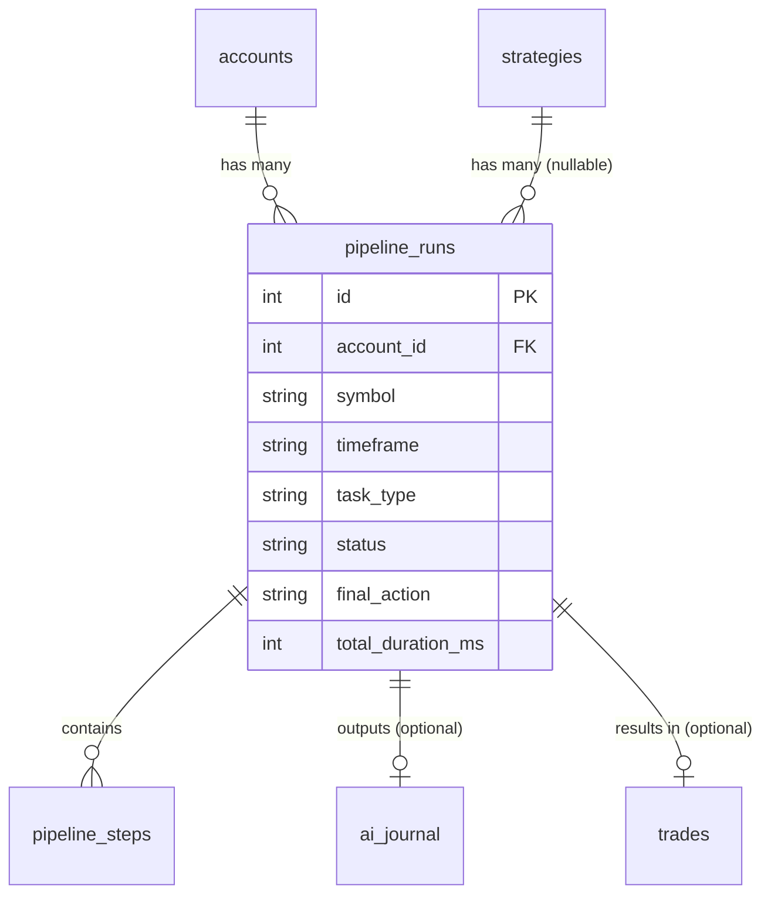

<Callout type="abstract">
Tracks each execution of the multi-agent LLM pipeline — one row per analysis run, linking the trigger (account + symbol + timeframe) to its outcome (signal, trade, or hold).
</Callout>

## Table Info

| Property | Value |
| :--- | :--- |
| **Table Name** | `pipeline_runs` |
| **SQLAlchemy Model** | `backend/db/models.py :: PipelineRun` |
| **Pydantic Schema** | `backend/api/routes/pipeline.py` |
| **Migration File** | `alembic/versions/` |
| **TimescaleDB Hypertable** | No |
| **Partition Column** | — |


## Columns

| Column | SQLAlchemy Type | Nullable | Default | Description |
| :--- | :--- | :--- | :--- | :--- |
| `id` | `Integer` | No | auto | Primary key |
| `account_id` | `Integer` FK | No | — | FK → `accounts.id` (indexed) |
| `symbol` | `String(20)` | No | — | Symbol analyzed (indexed) |
| `timeframe` | `String(10)` | No | — | Timeframe of analysis (e.g., `M15`) |
| `task_type` | `String(20)` | No | `"signal"` | `signal` \| `maintenance` |
| `status` | `String(20)` | No | `"running"` | `running` \| `completed` \| `hold` \| `skipped` \| `failed` |
| `final_action` | `String(15)` | Yes | `null` | Final decision: `BUY`, `SELL`, `HOLD`, etc. |
| `total_duration_ms` | `Integer` | Yes | `null` | Total pipeline wall-clock time in ms |
| `journal_id` | `Integer` FK | Yes | `null` | FK → `ai_journal.id` (the resulting signal) |
| `trade_id` | `Integer` FK | Yes | `null` | FK → `trades.id` (the resulting trade, if any) |
| `strategy_id` | `Integer` FK | Yes | `null` | FK → `strategies.id` (SET NULL on delete) |
| `created_at` | `DateTime(timezone=True)` | No | `datetime.now(UTC)` | Run start timestamp (indexed) |


## Constraints & Indexes

| Name | Type | Columns | Purpose |
| :--- | :--- | :--- | :--- |
| `pk_pipeline_runs` | PRIMARY KEY | `id` | Row uniqueness |
| `idx_pipeline_account` | INDEX | `account_id` | Filter by account |
| `idx_pipeline_symbol` | INDEX | `symbol` | Filter by symbol |
| `idx_pipeline_created` | INDEX | `created_at` | Time-range queries |


## Entity Relationships




## SQLAlchemy Model (reference snapshot)

```python
class PipelineRun(Base):
    __tablename__ = "pipeline_runs"

    id: Mapped[int] = mapped_column(Integer, primary_key=True)
    account_id: Mapped[int] = mapped_column(Integer, ForeignKey("accounts.id"), index=True)
    symbol: Mapped[str] = mapped_column(String(20), index=True)
    timeframe: Mapped[str] = mapped_column(String(10))
    task_type: Mapped[str] = mapped_column(String(20), default="signal")
    status: Mapped[str] = mapped_column(String(20), default="running")
    final_action: Mapped[str | None] = mapped_column(String(15), nullable=True)
    total_duration_ms: Mapped[int | None] = mapped_column(Integer, nullable=True)
    journal_id: Mapped[int | None] = mapped_column(Integer, ForeignKey("ai_journal.id"), nullable=True)
    trade_id: Mapped[int | None] = mapped_column(Integer, ForeignKey("trades.id"), nullable=True)
    strategy_id: Mapped[int | None] = mapped_column(
        Integer, ForeignKey("strategies.id", ondelete="SET NULL"), nullable=True
    )
    created_at: Mapped[datetime] = mapped_column(DateTime(timezone=True), default=lambda: datetime.now(UTC), index=True)

    steps: Mapped[list["PipelineStep"]] = relationship(
        "PipelineStep", back_populates="run", cascade="all, delete-orphan",
        order_by="PipelineStep.seq",
    )
```


## Service Layer

| Layer | File | Purpose |
| :--- | :--- | :--- |
| Router | `backend/api/routes/pipeline.py` | List runs, stream status |
| AI Pipeline | `backend/ai/` | Creates and updates runs during execution |


## 🗂️ Related

| Role | Link |
| :--- | :--- |
| API Endpoint | [API-GET-v1-Pipeline](API-GET-v1-Pipeline) |
| Frontend Page | [Page - Agent Workflow](/en/docs/llmsystemtrading/frontend/pages/page-agent-workflow) |
| Related Table | [DB - pipeline_steps](/en/docs/llmsystemtrading/database/db-pipeline-steps) |
| Related Table | [DB - ai_journal](/en/docs/llmsystemtrading/database/db-ai-journal) |
| Related Table | [DB - llm_calls](/en/docs/llmsystemtrading/database/db-llm-calls) |
