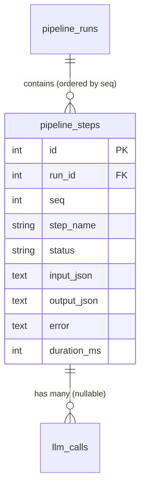

<Callout type="abstract">
Records each individual agent step within a pipeline run — input/output JSON, status, and duration — providing a detailed trace of the multi-agent reasoning chain.
</Callout>

## Table Info

| Property | Value |
| :--- | :--- |
| **Table Name** | `pipeline_steps` |
| **SQLAlchemy Model** | `backend/db/models.py :: PipelineStep` |
| **Pydantic Schema** | `backend/api/routes/pipeline.py` |
| **Migration File** | `alembic/versions/` |
| **TimescaleDB Hypertable** | No |
| **Partition Column** | — |


## Columns

| Column | SQLAlchemy Type | Nullable | Default | Description |
| :--- | :--- | :--- | :--- | :--- |
| `id` | `Integer` | No | auto | Primary key |
| `run_id` | `Integer` FK | No | — | FK → `pipeline_runs.id` (CASCADE delete, indexed) |
| `seq` | `Integer` | No | — | Step sequence number within the run (ordered) |
| `step_name` | `String(50)` | No | — | Agent step name (e.g., `indicator_agent`, `trend_agent`) |
| `status` | `String(10)` | No | — | `ok` \| `skip` \| `error` |
| `input_json` | `Text` | Yes | `null` | JSON input payload to this step |
| `output_json` | `Text` | Yes | `null` | JSON output from this step |
| `error` | `Text` | Yes | `null` | Error message if `status=error` |
| `duration_ms` | `Integer` | No | `0` | Step execution time in milliseconds |


## Constraints & Indexes

| Name | Type | Columns | Purpose |
| :--- | :--- | :--- | :--- |
| `pk_pipeline_steps` | PRIMARY KEY | `id` | Row uniqueness |
| `idx_pipeline_steps_run` | INDEX | `run_id` | Fast lookup of steps by run |
| `fk_pipeline_steps_run` | FOREIGN KEY | `run_id → pipeline_runs.id CASCADE` | Delete steps when run deleted |


## Entity Relationships




## SQLAlchemy Model (reference snapshot)

```python
class PipelineStep(Base):
    __tablename__ = "pipeline_steps"

    id: Mapped[int] = mapped_column(Integer, primary_key=True)
    run_id: Mapped[int] = mapped_column(
        Integer, ForeignKey("pipeline_runs.id", ondelete="CASCADE"), index=True
    )
    seq: Mapped[int] = mapped_column(Integer)
    step_name: Mapped[str] = mapped_column(String(50))
    status: Mapped[str] = mapped_column(String(10))  # ok | skip | error
    input_json: Mapped[str | None] = mapped_column(Text, nullable=True)
    output_json: Mapped[str | None] = mapped_column(Text, nullable=True)
    error: Mapped[str | None] = mapped_column(Text, nullable=True)
    duration_ms: Mapped[int] = mapped_column(Integer, default=0)

    run: Mapped["PipelineRun"] = relationship("PipelineRun", back_populates="steps")
```


## 🗂️ Related

| Role | Link |
| :--- | :--- |
| Related Table | [DB - pipeline_runs](/en/docs/llmsystemtrading/database/db-pipeline-runs) |
| Related Table | [DB - llm_calls](/en/docs/llmsystemtrading/database/db-llm-calls) |
