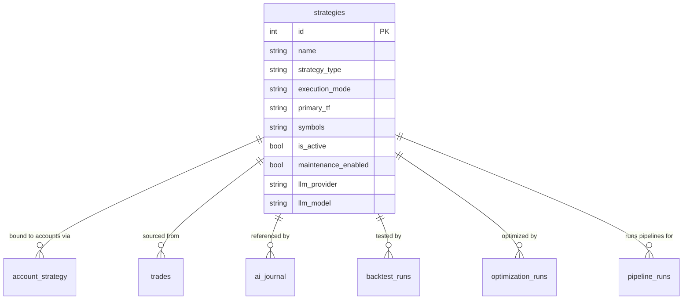

<Callout type="abstract">
Defines trading strategy configurations — symbols, timeframes, LLM provider overrides, execution mode, and time-based filters — used by the scheduler to drive automated analysis.
</Callout>

## Table Info

| Property | Value |
| :--- | :--- |
| **Table Name** | `strategies` |
| **SQLAlchemy Model** | `backend/db/models.py :: Strategy` |
| **Pydantic Schema** | `backend/api/routes/strategies.py :: StrategyCreate / StrategyResponse` |
| **Migration File** | `alembic/versions/` |
| **TimescaleDB Hypertable** | No |
| **Partition Column** | — |


## Columns

| Column | SQLAlchemy Type | Nullable | Default | Description |
| :--- | :--- | :--- | :--- | :--- |
| `id` | `Integer` | No | auto | Primary key |
| `name` | `String(255)` | No | — | Unique strategy name |
| `description` | `Text` | Yes | `null` | Optional human-readable description |
| `strategy_type` | `String(20)` | No | `"config"` | `config` \| `prompt` \| `code` |
| `execution_mode` | `String(30)` | No | `"llm_only"` | `llm_only` \| `rule_then_llm` \| `rule_only` \| `hybrid_validator` \| `multi_agent` |
| `primary_tf` | `String(10)` | No | `"M15"` | Primary analysis timeframe |
| `context_tfs` | `Text` | No | `"[]"` | JSON list of context timeframes |
| `trigger_type` | `String(20)` | No | `"candle_close"` | `candle_close` \| `interval` |
| `interval_minutes` | `Integer` | Yes | `null` | Used when `trigger_type=interval` |
| `symbols` | `Text` | No | `"[]"` | JSON list of symbols to trade |
| `timeframe` | `String(10)` | No | `"M15"` | Legacy/display timeframe field |
| `lot_size` | `Float` | Yes | `null` | Fixed lot size; null = use account `risk_pct` |
| `sl_pips` | `Float` | Yes | `null` | Stop-loss in pips; null = LLM decides |
| `tp_pips` | `Float` | Yes | `null` | Take-profit in pips; null = LLM decides |
| `news_filter` | `Boolean` | No | `True` | Skip analysis during high-impact news events |
| `custom_prompt` | `Text` | Yes | `null` | Custom system prompt injected into LLM calls |
| `module_path` | `String(255)` | Yes | `null` | Python module path for `code` type strategies |
| `class_name` | `String(255)` | Yes | `null` | Class name within `module_path` |
| `strategy_key` | `String(100)` | Yes | `null` | Registry key (e.g., `"harmonic"`) |
| `strategy_params` | `Text` | Yes | `null` | JSON dict of parameter overrides |
| `is_active` | `Boolean` | No | `True` | Scheduler runs this strategy when True |
| `maintenance_enabled` | `Boolean` | No | `True` | Maintenance agent monitors open trades |
| `skip_hours` | `Text` | Yes | `null` | JSON int list of hours to skip (e.g., `[4,6,7]`) |
| `skip_hours_timezone` | `String(60)` | Yes | `null` | IANA timezone for `skip_hours` (e.g., `"Asia/Bangkok"`) |
| `skip_weekdays` | `Text` | Yes | `null` | JSON int list of weekdays to skip (0=Mon, 6=Sun) |
| `llm_provider` | `String(50)` | Yes | `null` | Override global provider: `openai` \| `gemini` \| `anthropic` \| `openrouter` |
| `llm_model` | `String(100)` | Yes | `null` | Override model name (e.g., `"gpt-4o"`) |
| `created_at` | `DateTime(timezone=True)` | No | `datetime.now(UTC)` | Creation timestamp |


## Constraints & Indexes

| Name | Type | Columns | Purpose |
| :--- | :--- | :--- | :--- |
| `pk_strategies` | PRIMARY KEY | `id` | Row uniqueness |
| `uq_strategies_name` | UNIQUE | `name` | No duplicate strategy names |


## Entity Relationships




## SQLAlchemy Model (reference snapshot)

```python
class Strategy(Base):
    __tablename__ = "strategies"

    id: Mapped[int] = mapped_column(Integer, primary_key=True)
    name: Mapped[str] = mapped_column(String(255), unique=True)
    description: Mapped[str | None] = mapped_column(Text, nullable=True)
    strategy_type: Mapped[str] = mapped_column(String(20), default="config")
    execution_mode: Mapped[str] = mapped_column(String(30), default="llm_only")
    primary_tf: Mapped[str] = mapped_column(String(10), default="M15")
    context_tfs: Mapped[str] = mapped_column(Text, default="[]")      # JSON list
    trigger_type: Mapped[str] = mapped_column(String(20), default="candle_close")
    interval_minutes: Mapped[int | None] = mapped_column(Integer, nullable=True)
    symbols: Mapped[str] = mapped_column(Text, default="[]")           # JSON list
    timeframe: Mapped[str] = mapped_column(String(10), default="M15")
    lot_size: Mapped[float | None] = mapped_column(Float, nullable=True)
    sl_pips: Mapped[float | None] = mapped_column(Float, nullable=True)
    tp_pips: Mapped[float | None] = mapped_column(Float, nullable=True)
    news_filter: Mapped[bool] = mapped_column(Boolean, default=True)
    custom_prompt: Mapped[str | None] = mapped_column(Text, nullable=True)
    module_path: Mapped[str | None] = mapped_column(String(255), nullable=True)
    class_name: Mapped[str | None] = mapped_column(String(255), nullable=True)
    strategy_key: Mapped[str | None] = mapped_column(String(100), nullable=True)
    strategy_params: Mapped[str | None] = mapped_column(Text, nullable=True)  # JSON dict
    is_active: Mapped[bool] = mapped_column(Boolean, default=True)
    maintenance_enabled: Mapped[bool] = mapped_column(Boolean, default=True)
    skip_hours: Mapped[str | None] = mapped_column(Text, nullable=True)
    skip_hours_timezone: Mapped[str | None] = mapped_column(String(60), nullable=True)
    skip_weekdays: Mapped[str | None] = mapped_column(Text, nullable=True)
    llm_provider: Mapped[str | None] = mapped_column(String(50), nullable=True)
    llm_model: Mapped[str | None] = mapped_column(String(100), nullable=True)
    created_at: Mapped[datetime] = mapped_column(DateTime(timezone=True), default=lambda: datetime.now(UTC))

    account_bindings: Mapped[list["AccountStrategy"]] = relationship(
        "AccountStrategy", back_populates="strategy", cascade="all, delete-orphan"
    )
    trades: Mapped[list["Trade"]] = relationship("Trade", back_populates="strategy")
```


## Service Layer

| Layer | File | Purpose |
| :--- | :--- | :--- |
| Router | `backend/api/routes/strategies.py` | CRUD + binding management |
| Scheduler | `backend/services/scheduler.py` | `add_binding_jobs()`, `remove_binding_jobs()` |
| AI Pipeline | `backend/ai/` | Reads strategy config to run LLM analysis |


## 🗂️ Related

| Role | Link |
| :--- | :--- |
| API Endpoint | [API-POST-v1-Strategies](API-POST-v1-Strategies) |
| Frontend Page | [Page - Settings](/en/docs/llmsystemtrading/frontend/pages/page-settings) |
| Related Table | [DB - account_strategy](/en/docs/llmsystemtrading/database/db-account-strategy) |
| Related Table | [DB - trades](/en/docs/llmsystemtrading/database/db-trades) |
| Related Table | [DB - backtest_runs](/en/docs/llmsystemtrading/database/db-backtest-runs) |
